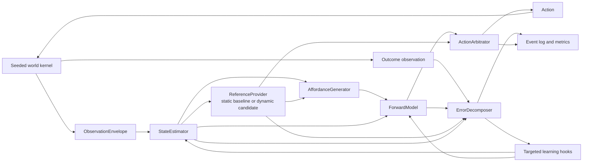

# MW-EPIC-001: Cognitive Miniworld Primitive Testbed

**Status:** Proposed
**Knowledge graph:** `cognitive-miniworld-knowledge-graph.jsonld`
**Primary implementation language:** CPython 3.14.7 free-threaded
**Design stance:** deterministic kernel, explicit stochastic boundaries, typed black-box primitives, ablation before composition

## 1. Objective

Build a small, reproducible world in which candidate cognitive primitives can be tested independently against simpler baselines. The deliverable is not a simulated human brain and not a demo that merely looks intelligent. It is an experimental harness that can answer:

> Does this primitive produce measurable improvement in regulation, calibration, adaptation, or value-per-compute under the conditions it was designed to handle?

The source material supports several computational roles, but it does not establish a canonical software architecture. The plan therefore treats each software boundary as an **engineering hypothesis** with a kill test.

## 2. Theory under test

The first program tests five claims:

1. **Endogenous regulation:** predicted viability demands can generate dynamic reference trajectories and coherent action without an externally supplied task reward.
2. **Typed error:** prediction, control, outcome, timing, agency, and learning-progress errors should remain distinct because they imply different updates.
3. **Useful curiosity:** epistemic action should track expected learning progress and relevance, not raw novelty or surprise.
4. **Appraisal as control state:** emotion-like policy differences can emerge from continuous appraisal dimensions without `FearAgent` or `AngerAgent` modules.
5. **Resource-bounded cognition:** salience decides what deserves consideration; metacontrol decides whether additional computation is worth its cost.

These are project hypotheses, not conclusions imported from neuroscience.

## 3. Source-derived constraints

The starter schematic contributes four high-value constraints:

- Targets may be **trajectories**, not fixed set points.
- Regulated resources and controlled processes are not interchangeable.
- Prediction error and control error are distinct.
- APIC is a theory with explicit failure conditions, not an experimentally validated brain map.

The broader graph adds bounded evidence for internal models, action competition, cognitive-control cost, complementary learning systems, delayed credit, learning-progress curiosity, appraisal processes, and graded confidence. Each source node records its evidence class and scope limit.

## 4. Non-goals

- No consciousness claim.
- No one-to-one mapping between source paper boxes and anatomy.
- No LLM in the core milestones.
- No neural network until a tabular or analytic baseline is insufficient.
- No single global reward scalar standing in for every learning and control signal.
- No GUI before deterministic replay, baselines, and metrics work.
- No Rust port without a profile showing a stable, dominant hotspot.

## 5. Architectural invariants

1. **Explicit randomness:** every stochastic component receives an RNG object or immutable RNG state. Hidden module-global randomness is forbidden.
2. **Replayability:** scenario manifest + seed + component versions + event log must reproduce the same terminal state and digest.
3. **No oracle leakage:** hidden ground truth is accessible only to evaluation code.
4. **Typed messages:** primitives exchange immutable contracts rather than reaching into each other's state.
5. **Ablation:** every primitive is feature-flagged and replaceable by a baseline implementation.
6. **Provenance:** beliefs, memories, decisions, and updates retain source event identifiers.
7. **Metric preregistration:** each scenario declares one primary metric, safety metrics, a minimum meaningful effect, and a kill condition before benchmark runs.
8. **Present evidence wins:** memory contributes evidence to state estimation; it cannot directly overwrite current observations.
9. **Concurrency isolation:** concurrency is permitted only across isolated scenario/seed/variant runs. A tick and episode remain single-threaded, share no mutable behavioral state, and produce the same per-run digests regardless of worker count or scheduling.

## 6. Proposed system topology



Adaptive and learning primitives attach to this spine only after the core contracts are stable.

## 7. Miniworld specification

### 7.1 World model

Use a small discrete two-dimensional grid or equivalent graph. The world advances in ticks. Ground truth includes:

- agent position,
- energy and integrity,
- ambient demand multiplier,
- resource location and hidden quality,
- hazard state,
- sensor reliability,
- delayed action consequences,
- per-tick compute allowance.

Keep the first world deliberately tiny. Complexity comes from controlled partial observability and changing contingencies, not map size.

### 7.2 Action set

`move`, `inspect`, `consume`, `rest`, `probe`, `wait`, and `retreat`.

Each action declares cost, duration, reversibility, required preconditions, and observation effects. Some actions consume world time while the agent is computing.

### 7.3 Observation channels

- **Exteroceptive:** noisy local cells, objects, hazards, and events.
- **Interoceptive:** noisy energy, integrity, and demand estimates.
- **Temporal:** observed event timing and delays.
- **Efference copy:** the action command the agent attempted.

Hidden state is never included in an observation contract.

### 7.4 Adversarial fixtures

- A predictable weather cycle that raises energy cost before depletion.
- An abrupt action-transition change, such as movement becoming slower or more costly.
- Hidden action preconditions that make some apparent affordances impossible.
- A resource that looks beneficial but causes delayed damage.
- A high-entropy `noisy_tv` object with no learnable transition structure.
- A difficult but learnable region whose prediction loss improves with probing.
- A distractor storm generating thousands of irrelevant changes.
- A working-memory churn fixture where one quiet causal cue must survive many later distractors.
- A silent sensor-reliability degradation.
- A regime shift that invalidates a previously successful habit.

## 8. Repository layout

```text
cognitive-miniworld/
├── pyproject.toml
├── README.md
├── knowledge/
│   ├── cognitive-miniworld-knowledge-graph.jsonld
│   └── queries.sparql
├── src/cmw/
│   ├── contracts.py
│   ├── rng.py
│   ├── events.py
│   ├── kernel/
│   │   ├── state.py
│   │   ├── transition.py
│   │   └── observations.py
│   ├── primitives/
│   │   ├── reference.py
│   │   ├── estimation.py
│   │   ├── prediction.py
│   │   ├── errors.py
│   │   ├── affordances.py
│   │   ├── arbitration.py
│   │   ├── salience.py
│   │   ├── metacontrol.py
│   │   ├── curiosity.py
│   │   ├── memory.py
│   │   ├── credit.py
│   │   ├── appraisal.py
│   │   └── self_model.py
│   ├── agents/
│   │   ├── reactive.py
│   │   ├── oracle.py
│   │   └── composed.py
│   ├── scenarios/
│   │   ├── manifest.py
│   │   └── fixtures.py
│   ├── experiments/
│   │   ├── runner.py
│   │   ├── ablation.py
│   │   └── statistics.py
│   └── telemetry/
│       ├── event_log.py
│       ├── metrics.py
│       └── report.py
└── tests/
    ├── contracts/
    ├── kernel/
    ├── primitives/
    ├── properties/
    ├── metamorphic/
    └── experiments/
```

### Recommended dependencies

- CPython 3.14.7 free-threaded (`3.14.7t` in `uv`)
- `uv`, `ruff`, `ty`, `pytest`, and `hypothesis`
- `msgspec` for immutable typed messages and serialization
- `numpy` only where probability distributions require it
- JSONL for canonical event logs in the first release
- Parquet as a derived benchmark format once experiment volume justifies it

Do not make Gymnasium, a neural framework, a web server, or a database a core dependency. Adapters can come later.

## 9. Canonical contracts

```python
class StateEstimator(Protocol):
    def update(
        self,
        prior: BeliefState,
        observations: tuple[ObservationEnvelope, ...],
        previous_action: ActionDecision | None,
    ) -> BeliefState: ...

class ReferenceGenerator(Protocol):
    def generate(
        self,
        belief: BeliefState,
        budget: ResourceBudget,
        horizon: int,
    ) -> tuple[ReferenceTrajectory, ...]: ...

class ForwardModel(Protocol):
    def predict(
        self,
        belief: BeliefState,
        action: ActionProposal,
        horizon: int,
    ) -> PredictionDistribution: ...

class ErrorDecomposer(Protocol):
    def compare(
        self,
        prediction: PredictionDistribution,
        posterior: BeliefState,
        references: tuple[ReferenceTrajectory, ...],
        outcome: tuple[ObservationEnvelope, ...],
    ) -> ErrorBundle: ...

class AffordanceGenerator(Protocol):
    def propose(
        self,
        belief: BeliefState,
        references: tuple[ReferenceTrajectory, ...],
    ) -> tuple[ActionProposal, ...]: ...

class ActionArbitrator(Protocol):
    def choose(
        self,
        proposals: tuple[ActionProposal, ...],
        predictions: tuple[PredictionDistribution, ...],
        references: tuple[ReferenceTrajectory, ...],
        budget: ResourceBudget,
    ) -> ActionDecision: ...
```

Contracts should expose outputs, uncertainty, and provenance, but not implementation internals.

## 10. Tick lifecycle

1. World emits observations.
2. State estimator updates the belief distribution.
3. Reference provider creates viability trajectories; the core begins with a static baseline and later substitutes the dynamic `ReferenceGenerator` candidate.
4. Affordance generator proposes feasible actions.
5. Forward model predicts outcomes for selected proposals.
6. Action arbitrator selects action and intensity.
7. World applies the action and advances time.
8. Error decomposer compares expectation, posterior evidence, and references.
9. Eligible learners receive typed update signals.
10. Event log records all inputs, outputs, versions, costs, and hashes.

## 11. Experimental protocol

### 11.1 Run tiers

| Tier | Purpose | Seed set |
|---|---|---:|
| Unit | Contract and mathematical correctness | hand-selected |
| Smoke | Detect crashes and obvious regressions | 5 fixed seeds |
| CI experiment | Catch behavioral drift | 20 fixed paired seeds |
| Benchmark | Decide promotion or rejection | 100 paired seeds by default |

The benchmark seed count is a starting engineering policy, not a scientific universal. Increase it when variance makes the conclusion unstable.

### 11.2 Comparison rules

- Use identical scenario seeds for baseline and candidate.
- Freeze the primary metric and minimum meaningful effect after the baseline pilot.
- Report effect size and a paired bootstrap confidence interval.
- Treat safety metrics as noninferiority gates.
- Separate exploratory metrics from confirmatory metrics.
- Never promote a primitive from aggregate task reward alone.

### 11.3 Required comparisons

1. Baseline alone.
2. Baseline plus candidate primitive.
3. Current full composition.
4. Full composition with the candidate ablated.
5. Oracle upper bound where definable.

## 12. Hypotheses and kill tests

| Hypothesis | Candidate | Primary experiment | Kill condition |
|---|---|---|---|
| Dynamic references anticipate demand | `ReferenceGenerator` | Predictable demand shift | No paired-seed improvement over fixed set point, or safety regression |
| Belief distributions improve action under hidden state | `StateEstimator` | Partial observability | Calibration and false-belief recovery do not beat carry-forward baseline |
| Action-conditioned prediction improves planning | `ForwardModel` | Transition shift | Prediction does not beat identity baseline, fails to adapt, or does not improve decisions |
| Candidate generation preserves feasible options | `AffordanceGenerator` | Affordance coverage | Best feasible actions are omitted or impossible proposals are not reduced |
| Bounded active state resists interference | `WorkingMemoryGate` | Working-memory interference | Critical signal retention does not beat FIFO or viability degrades materially |
| Typed errors improve targeted learning | `ErrorDecomposer` | Error disagreement | No improvement in credit precision or unnecessary regulation increases |
| Curiosity follows learnability | `EpistemicController` | Learnable unknown + noisy TV | Agent remains trapped by random noise or abandons a learnable task |
| Salience preserves critical signals | `SalienceRouter` | Distractor flood | Critical-signal retention or value-per-compute does not improve |
| Metacontrol buys useful computation | `MetacontrolAllocator` | Compute-budget ladder | Cannot beat any fixed budget without more irreversible mistakes |
| Fast/slow memory reduces interference | `EpisodicRecorder` + `Consolidator` | Consolidation interference | No reduction in overwrite or inability to revise a false generalization |
| Eligibility improves delayed credit | `CreditAssigner` | Delayed causal chain | Noncausal distractors receive equivalent updates |
| Appraisal dimensions alter policy | `Appraiser` | Same valence, different control | No advantage over valence-only policy |
| Self-estimation calibrates reliance | `SelfEstimator` | Silent sensor degradation | Confidence fails to track accuracy or behavior does not adapt |
| Habits remain reversible | `PolicyInvalidator` | Habit reversal | No compute savings before shift or persistent failure after shift |

## 13. Work breakdown

### Milestone 0: Foundation and reproducibility

#### MW-001 — Repository and quality gates

**Deliverables**

- `uv` project, pinned dependency lock, `ruff`, `ty`, `pytest`, and Hypothesis.
- CI commands for unit, property, replay, and experiment smoke tests.
- Semantic version recorded in every run manifest.
- Free-threaded 3.14.7 primary CI with conventional 3.14.7 compatibility.
- Native dependency stress and adaptive 1→2→4 scaling qualification.

**Acceptance**

- Clean environment can run the test suite from the lock file.
- A failing property or replay mismatch fails CI.
- The primary runtime reports a free-threaded build and keeps the GIL disabled after native imports.
- Threaded qualification produces identical outputs and improves median time by at least 5% at each available 1→2→4 worker step.

#### MW-002 — Canonical data contracts

**Deliverables**

- Immutable definitions for observation, belief, reference, proposal, prediction, error, trace, budget, and self-estimate.
- Stable serialization and schema-version fields.

**Acceptance**

- Round-trip serialization is lossless.
- Provenance and uncertainty fields cannot be omitted from belief and prediction objects.
- Contract tests reject hidden mutable references.

#### MW-003 — Explicit RNG and deterministic replay

**Deliverables**

- RNG wrapper with named streams for world, observations, and candidate stochastic modules.
- Canonical event serialization and digest.
- Replay command.

**Acceptance**

- A completed run replays to the same event and terminal-state hashes.
- Reordering unrelated RNG streams does not alter another stream's sequence.
- Concurrent scheduling of isolated named streams does not alter their sequences.

#### MW-004 — World kernel

**Deliverables**

- Pure transition function.
- Hidden `WorldState` and public observation generator.
- Viability dynamics and action costs.

**Acceptance**

- Property tests enforce conservation and bounds.
- Candidate modules cannot import or receive hidden state types.

#### MW-005 — Scenario manifests and fixture library

**Deliverables**

- Declarative scenario format with version, seed set, hidden parameters, primary metric, safety metrics, and kill criterion.
- Initial fixtures for demand shift, delayed poison, noisy TV, learnable unknown, distractor flood, sensor degradation, and habit reversal.

**Acceptance**

- Each manifest is hashable and self-contained.
- Invalid scenarios fail before simulation begins.

#### MW-006 — Telemetry and metrics

**Deliverables**

- Append-only JSONL event log.
- Metric functions that consume events rather than primitive internals.
- Run summary with configuration hashes and paired-seed comparison identifiers.
- Diagnostic interpreter, ABI, GIL-state, executor, and worker-count metadata outside behavioral digests.

**Acceptance**

- Metrics recompute from the event log alone.
- Evaluator-only ground truth is clearly separated from agent-visible events.

#### MW-007 — Baselines and oracle

**Deliverables**

- Reactive fixed-setpoint controller.
- Last-observation estimator.
- Random and prediction-error curiosity baselines.
- Oracle policy for upper-bound analysis where tractable.

**Acceptance**

- Baselines cover all first-wave experiments.
- Oracle is unavailable through agent interfaces.

**Milestone gate:** deterministic replay passes; baseline performance is stable enough to expose a measurable oracle gap.

### Milestone 1: Predictive closed-loop spine

#### MW-010 — State estimator

Begin with an exact Bayesian filter or tabular hidden-state filter. Do not start with a learned neural estimator.

**Acceptance**

- Properly normalized posterior.
- Calibration beats last-observation baseline in partial-observability scenarios.
- Contradictory evidence can reverse a stale belief.

#### MW-011 — Forward model

Begin with known transition tables, then add a learned tabular model as a separate implementation.

**Acceptance**

- Prediction distributions use a proper scoring rule.
- Learned model adapts after a regime shift.
- Action selection with predictions beats the reactive baseline in at least one delayed-consequence scenario.

#### MW-012 — Typed error decomposer

**Acceptance**

- Produces distinct sensory, control, outcome, timing, agency, and learning-progress channels.
- Expected-but-undesirable and unexpected-but-safe fixtures produce different bundles.
- Scalar-error baseline remains available for ablation.

#### MW-013 — Affordance generator

**Acceptance**

- Generates only actions whose observable preconditions are believed possible.
- Maintains multiple candidates when evidence is incomplete.
- Failure to generate and failure to select are separately observable.

#### MW-014 — Action arbitrator

Use a transparent baseline value function before learned policies:

\[
V(a) = \text{reference progress} - \text{risk} - \text{cost} + \text{information value}
\]

**Acceptance**

- Produces rationale and uncertainty with the decision.
- Avoids dominated irreversible actions when a safer alternative exists.
- Regret is measurable against the oracle.

**Milestone gate:** the nonlinguistic loop can survive, recover from hidden-state errors, and outperform a reactive controller in a delayed-consequence scenario.

### Milestone 2: Endogenous regulation

#### MW-020 — Dynamic reference generator

**Acceptance**

- References vary with predicted demand and state.
- The agent anticipates a known demand rise rather than waiting for depletion.
- Reference provenance explains which state estimate and forecast produced each trajectory.

#### MW-021 — State-relative outcome valuation

**Acceptance**

- The same resource has different marginal value under deprivation, sufficiency, and excess.
- No reward constant is hard-coded as universally positive.

**Milestone gate:** dynamic references beat fixed set points on the preregistered demand-shift experiment without increasing irreversible errors.

### Milestone 3: Allocation and self-directed exploration

#### MW-030 — Salience router

**Acceptance**

- Preserves low-novelty viability signals under a distractor flood.
- Does not equate novelty with importance.
- Reports admitted and dropped signals with reasons.

#### MW-031 — Metacontrol allocator

**Acceptance**

- Implements at least fixed-budget, always-max, and expected-value-of-compute policies.
- Stops computation when expected marginal gain falls below cost.
- Value-per-compute improves over at least one fixed policy.

#### MW-032 — Epistemic controller

**Acceptance**

- Explores a learnable unknown.
- Reduces exploration after mastery.
- Disengages from the noisy TV after observed learning progress remains near zero.
- Information gain is scored by downstream model or decision improvement, not similarity.

**Milestone gate:** the agent distinguishes novelty from learnability and avoids both distraction capture and unlimited deliberation.

### Milestone 4: Memory and credit

#### MW-040 — Episodic recorder

**Acceptance**

- Records context, belief, references, proposal, prediction, action, outcome, errors, and provenance.
- Retrieval results include why they matched.
- Retrieval usefulness is measured by decision delta.

#### MW-041 — Credit assigner

**Acceptance**

- Eligibility decays explicitly over simulated time.
- Delayed reward updates true causal contributors more than distractors.
- Global reinforcement remains an ablation baseline.

#### MW-042 — Consolidator and semantic model

**Acceptance**

- New episodes are interleaved rather than immediately overwriting general knowledge.
- Semantic claims retain links to supporting and contradicting episodes.
- A false generalization can be revised.

#### MW-043 — Procedural policy and invalidator

**Acceptance**

- Repeated successful decisions consume less compute after compilation.
- Distribution-shift evidence suspends the policy.
- The deliberative path remains available for re-learning.

#### MW-044 — Working-memory gate

**Deliverables**

- Bounded active representation store with explicit admit, maintain, replace, and suppress operations.
- FIFO and unbounded-context baselines.
- Working-memory interference scenario and retention metrics.

**Acceptance**

- A quiet causal or viability-relevant cue survives distractor churn better than FIFO.
- Compute savings do not exceed the preregistered viability noninferiority margin.

**Milestone gate:** the agent gains efficiency from experience without catastrophic overwrite, superstition, or irreversible habit rigidity.

### Milestone 5: Appraisal and self-estimation

#### MW-050 — Appraisal vector

Initial dimensions:

- goal relevance,
- expected harm and benefit,
- certainty,
- imminence,
- controllability,
- agency,
- novelty,
- urgency,
- approach and avoidance bias.

**Acceptance**

- Same-valence scenarios with different controllability or certainty produce different policies.
- Emotion labels are optional diagnostic projections, never inputs to control.

#### MW-051 — Self-estimator

**Acceptance**

- Tracks sensor reliability, model calibration, resource state, and recent failure regime.
- Silent degradation lowers confidence before catastrophic action.
- Confidence changes evidence gathering or action intensity.

**Milestone gate:** the system exhibits calibrated self-limitation and control-policy differentiation without a categorical emotion module.

### Milestone 6: Deferred higher-order experiments

#### MW-060 — Workspace gate

Test only as a bounded broadcast and coordination mechanism. Do not label it consciousness.

#### MW-061 — Plasticity scheduler

Test only after fixed learning rates and consolidation schedules provide a stable comparison.

#### MW-062 — Language adapter

Add after the nonlinguistic core passes all required gates. Compare core versus core-plus-language and measure incremental task-grounded value.

## 14. Testing strategy

### Unit tests

- Probability normalization.
- Reference interpolation and tolerance boundaries.
- Error-channel decomposition.
- Action precondition enforcement.
- Eligibility decay.
- Event serialization.

### Property tests

- Hidden state cannot appear in agent messages.
- Replaying an event sequence is idempotent.
- Probability mass remains valid.
- Increasing observation reliability cannot reduce its Bayesian weight under the reference estimator.
- No action creates energy or integrity unless the world transition explicitly models a source.

### Metamorphic tests

- Renaming entity identifiers does not change behavior.
- Translating the grid preserves policy outcomes.
- Splitting one distractor stream into equivalent streams does not alter viability decisions.
- Duplicating a memory does not double evidential weight unless the model represents independent evidence.
- Running the same ordered batch with one or multiple workers preserves every per-run semantic event digest and terminal hash.

### Free-threaded stress and performance tests

- Importing every native dependency leaves the GIL disabled in the primary runtime.
- Concurrent immutable-contract round trips are lossless and byte-stable.
- Independent deterministic CPU probes produce identical outputs at every worker count.
- On runners with at least two effective CPUs, median time improves by at least 5% from one to two workers; test two to four workers when four CPUs are available.
- Wall time is qualification evidence only and never enters a behavioral digest.

### Mutation tests

Target the logic most vulnerable to plausible-but-wrong behavior:

- swap prediction and control errors,
- invert gain or cost signs,
- disable uncertainty propagation,
- make noisy TV appear learnable,
- reinforce all eligible and ineligible contributors,
- prevent habit invalidation.

## 15. Observability

Emit one event per primitive invocation:

- run, episode, tick, primitive, implementation version,
- input and output digests,
- uncertainty summaries,
- compute units and wall time,
- selected versus rejected candidates,
- source event IDs,
- typed errors,
- learning updates,
- hidden evaluator labels in a separate channel,
- interpreter version, ABI/cache tag, free-threaded build flag, live GIL state, executor, and worker count as diagnostic metadata.

The system should answer after any failure:

> Was the world observed incorrectly, estimated incorrectly, predicted incorrectly, valued incorrectly, or acted on incorrectly?

## 16. Decision records to create

- **ADR-001:** Python reference implementation before Rust optimization.
- **ADR-002:** Explicit RNG streams and event-sourced replay.
- **ADR-003:** Immutable typed contracts between primitives.
- **ADR-004:** JSONL canonical log; Parquet derived analytics.
- **ADR-005:** No LLM in the core cognitive loop.
- **ADR-006:** No emotion enums as control inputs.
- **ADR-007:** Typed error vector instead of one global scalar.
- **ADR-008:** Baseline, ablation, oracle, and kill test required for promotion.
- **ADR-009:** Biological evidence and engineering analogy stored as different relation types.
- **ADR-015:** Python 3.14.7 free-threaded runtime and concurrency boundary; supersedes ADR-001's interpreter baseline.

## 17. Definition of done

The epic is complete when:

- the core six primitives pass contract, replay, and paired-seed benchmark gates;
- dynamic references outperform static regulation in the designated demand-shift scenario;
- the curiosity candidate abandons noisy TV while learning the tractable unknown;
- memory can revise a stale prior and consolidate without unacceptable interference;
- each primitive can be ablated without changing unrelated module behavior;
- every benchmark result is reproducible from the committed manifest and event log;
- per-run behavioral digests are invariant to serial versus threaded batch scheduling;
- every implemented primitive maps through the JSON-LD graph to bounded claims, source scope, experiments, metrics, and failure modes;
- no conclusion depends on subjective assessment that the agent “looks intelligent.”
