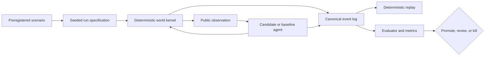

# ViabilityGrid

ViabilityGrid is a deterministic laboratory for deciding whether a proposed
cognitive mechanism is useful—or merely more complicated than its baseline.

## Aim

This repository asks one deliberately narrow question:

> Under the conditions a cognitive primitive claims to address, does it cause
> a reproducible improvement in regulation, calibration, adaptation, or
> value-per-compute over a simpler alternative?

The aim is not to assemble a convincing artificial mind. It is to turn ideas
such as predictive control, typed error, curiosity, appraisal, memory, and
metacontrol into separable engineering hypotheses with ways to fail.

A primitive earns promotion only when a preregistered experiment shows a
meaningful paired-seed effect, its ablation removes that effect, safety metrics
remain acceptable, and the gain justifies its compute cost. Otherwise it is
revised or killed. A milestone therefore closes with an evidence verdict, not
with a declaration of success.

## What this is—and is not

ViabilityGrid is an experimental harness with a small partially observable
world, explicit resource limits, replaceable candidate modules, simple
baselines, and an evaluator kept outside the agent boundary. It is designed to
answer causal comparison questions rather than produce an impressive demo.

It makes no consciousness claim, maps no software box directly to anatomy,
places no LLM in the core loop, and introduces no neural model before an exact
or tabular baseline proves insufficient. Hidden world truth is evaluator-only;
candidate modules receive immutable messages rather than privileged state.

## Experimental shape

The loop is intentionally auditable from specification to verdict:



This topology is executable for the Milestone 0 baseline/oracle qualification
and the first four core state-estimation, forward-model, typed-error, and
affordance comparisons. Later candidate primitives enter through the same
typed seams, one preregistered comparison at a time.

## What exists now

Package `0.11.0` retains the Milestone 0 substrate and adds the first four core
primitives:

- CPython 3.14.7 free-threaded is the primary locked runtime, with exact
  conventional 3.14.7 retained as a compatibility lane.
- `cmw.contracts` defines 15 immutable, versioned, provenance-aware component
  messages with deterministic abstract costs and canonical JSON.
- `cmw.rng` derives independent named streams for the world, observations, and
  candidate modules from `sha256(f"{root_seed}:{stream_name}")`.
- `cmw.events` canonically serializes ordered events and state updates.
- `cmw.replay` reconstructs terminal state from the event log and verifies the
  manifest, each event, the whole log, and terminal-state SHA-256 digests.
- `cmw.kernel` applies immutable world transitions over a configurable 2D grid,
  with bounded energy and integrity, authoritative action costs, hazards,
  consumable-resource conservation, delayed consequences, and hard terminal
  floors.
- The evaluator-only `WorldState` stays outside the public kernel API. Candidate
  code receives four typed observation channels generated with an independent
  explicit RNG continuation; resource quality and other ground truth remain
  hidden.
- `cmw.scenarios` defines strict canonical manifests, explicit smoke/CI/benchmark
  seed tiers, typed schedules, an agent-safe projection, and seven deterministic
  first-wave fixtures. Scheduled demand, transition, hazard, resource, and actual
  sensor-reliability changes are applied immutably inside the world tick.
- `cmw.telemetry` seals canonical events into bounded append-only JSONL, keeps
  evaluator truth out of agent channels, derives viability and safety metrics
  from the log alone, and records runtime diagnostics outside behavioral hashes.
- `cmw.agents` supplies a reactive fixed-setpoint controller, last-observation
  estimator, and random and prediction-error curiosity baselines. A closed
  resolver maps every first-wave fixture to runnable ablations.
- The exact `TabularStateEstimator` enumerates bounded finite hidden states,
  fuses noisy or delayed public evidence into normalized `BeliefState`
  posteriors, exposes calibrated marginals, and can reverse a strong stale
  prior without evaluator access or mutable learning state.
- `KnownTabularForwardModel` projects beliefs through complete declarative
  action tables, while the separate immutable `LearnedTabularForwardModel`
  revises recency-weighted transition counts from public
  belief-action-belief evidence and emits the frozen `PredictionDistribution`
  contract with horizon, provenance, and uncertainty.
- `BeliefAffordanceGenerator` emits every declarative action template whose
  boolean observable-precondition conjunction has positive belief support,
  keeps missing evidence possible with explicit support bounds, and reports
  generation failure separately from downstream selection failure.
- `TypedErrorDecomposer` separately computes sensory, state-revision, control,
  outcome, timing, binary agency, and learning-progress channels from public
  forecasts, beliefs, references, and observations. The executable scalar
  absolute-error collapse remains available only as an ablation baseline.
- `cmw.experiments` runs isolated serial or free-threaded paired episodes,
  materializes public stimuli without leaking evaluator schedules, confines the
  tractable demand-shift oracle to evaluation code, and rejects excessive work
  before compilation or worker creation.
- The MW-010 evaluator binds paired hidden-Markov traces to deterministic
  digests, compares binary Brier loss with last-observation and a perfect-truth
  ceiling, and revalidates every trace, posterior, bootstrap continuation, and
  stale-belief gate before encoding evidence.
- The MW-011 evaluator scores action-conditioned predictions with categorical
  Brier loss, checks recovery after an abrupt transition shift against identity
  and frozen-model ablations, and confines its downstream prediction selector
  to evaluation of the canonical delayed-poison fixture.
- The MW-012 evaluator contrasts expected-but-undesirable with
  unexpected-but-safe outcomes, measuring whether typed channels target model
  and control updates more precisely than the scalar absolute-error ablation.
- The MW-013 evaluator crosses every hidden truth assignment with every public
  observation mask, compares feasible-best-action recall with a goal-only
  baseline, and compares invalid-action rate with enumerating every action.
- The typed M0 gate revalidates run identities, replay hashes, event-derived
  metrics, safety counts, and the deterministic bootstrap before evidence is
  serialized.

The frozen 100-seed demand-shift comparison passed: baseline viability AUC
`0.1480487804878049`, oracle viability AUC `0.1876829268292683`, paired gain
`0.039634146341463394` with 95% interval
`[0.039634146341463346, 0.039634146341463346]`, and zero irreversible errors
in either arm. The minimum meaningful effect was `0.02`. This qualifies the
laboratory; it does not validate a later cognitive primitive.

The frozen 100-seed MW-010 comparison also passed: last-observation Brier loss
`0.31725000000000003`, tabular-filter loss `0.1923106475855707`, and paired
loss reduction `0.12493935241442927` with 95% interval
`[0.11495202199223027, 0.13500205647747124]`, against a minimum meaningful
effect of `0.02`. Every posterior normalized within
`1.1102230246251565e-16`, and probability `0.99` on a stale value reversed
after three contradictory ticks. See [the MW-010 verdict](docs/verdicts/MW-010.md).

The frozen 100-seed MW-011 comparison passed: learned pre-shift Brier loss was
`0.0666666030883789` versus identity loss `2.0`, and post-shift loss was
`0.13320315678902273` versus frozen-model loss `2.0`. The active transition row
recovered in two ticks, inside the four-tick bound. On `delayed_poison`, the
prediction-selected policy raised viability AUC from `0.1273170731707317` to
`0.14878048780487807`, a gain of `0.02146341463414636` for every paired seed,
after training only on public prior-episode observations. See
[the MW-011 verdict](docs/verdicts/MW-011.md).

The frozen 100-seed MW-012 comparison passed: typed credit precision was `1.0`
versus `0.5` for scalar absolute error, meeting the `0.5` improvement gate.
Typed routing made no unnecessary model or control updates; scalar collapse
over-routed one model update for every expected-but-undesirable fixture and one
unnecessary control response for every unexpected-but-safe fixture. On the
fixed control-cost safety adapter, typed viability AUC was `0.225` versus
`0.175` for scalar routing, a `0.05000000000000002` gain. See
[the MW-012 verdict](docs/verdicts/MW-012.md).

The frozen 100-seed MW-013 comparison passed: feasible-best-action recall was
`1.0` versus `0.5` for the goal-only baseline, while invalid-action rate fell
from `0.375` for enumerate-all to `0.23076923076923075`, a reduction of
`0.14423076923076922` above the `0.1` gate. Every incomplete-evidence case
retained at least two candidates, and generation and selection failure remained
distinct. See [the MW-013 verdict](docs/verdicts/MW-013.md).

## Try deterministic replay

`uv` installs the required `3.14.7t` interpreter from `.python-version` when
needed. This minimal demo isolates the replay mechanism; the experiment harness
in the next section exercises the complete Milestone 0 world and evaluator.

```bash
uv sync --locked --all-groups
cmw_demo_dir="$(mktemp -d)/run"
uv run --locked python -m cmw.replay --write-demo "$cmw_demo_dir"
uv run --locked python -m cmw.replay "$cmw_demo_dir"
```

Both replay commands emit the same event-log and terminal-state hashes with
`"matched": true`. Changing a canonical event, manifest, terminal state, or
recorded summary makes replay exit non-zero.

## Run the experiment harness

Use the smoke tier while developing:

```bash
uv run --locked python -m cmw.demo --tier smoke --workers 2
```

The benchmark tier is the frozen decision run, not a tuning loop. It always
uses seeds 1000–1099 and 10,000 paired-bootstrap resamples, and evidence paths
are created exclusively rather than overwritten:

```bash
cmw_evidence_dir="$(mktemp -d)"
uv run --locked python -m cmw.demo --tier benchmark --workers 4 \
  --evidence "$cmw_evidence_dir/m0-evidence.jsonl.gz"
```

The complete result, evidence digest, interpretation, and deviations are in
[the Milestone 0 verdict](docs/verdicts/M0.md).

## Design commitments

- Randomness is explicit and stream-local; module-global randomness is banned.
- Runs are event-sourced, canonically hashed, and replayable without wall time.
- Primitive boundaries are frozen typed messages, not shared implementation
  state.
- Every promoted primitive retains a simpler baseline and an ablation path.
- Concurrency is across isolated scenario/seed/variant runs only. A tick and an
  episode remain single-threaded, and scheduling never enters behavioral
  digests.
- Metrics are declared before benchmark runs and computed from observable
  events rather than primitive internals.

These constraints are experiment controls: relaxing one can make an apparent
algorithmic gain indistinguishable from a changed world realization, leaked
ground truth, hidden compute, or measurement drift.

## Validate the laboratory

Every commit must pass the locked environment, static analysis, all test tiers,
package build, and evidence-graph validation:

```bash
uv run --locked ruff check src tests
uv run --locked ty check
uv run --locked pytest
uv build
uv run --locked python knowledge/validate_graph.py \
    knowledge/cognitive-miniworld-knowledge-graph.jsonld
```

Focused tiers are available with `pytest -m property`, `pytest -m replay`,
`pytest -m freethreaded`, and `pytest -m performance`.

## Project map

```text
README.md          implemented architecture and operating constraints
CLAUDE.md          implementation invariants and working agreement
knowledge/         hypotheses, work packages, acceptance criteria, validator
docs/adr/          durable architectural decisions
docs/verdicts/     completed-work and milestone evidence
src/cmw/           executable experimental substrate
tests/             unit, property, replay, and runtime gates
```

The durable research program and dependency graph live in the
[knowledge graph](knowledge/cognitive-miniworld-knowledge-graph.jsonld), while
[GORDIAN](https://github.com/users/kmosoti/projects/8) tracks active scope and
delivery order. ADRs record decisions and verdicts record evidence. Milestone 0
is closed with a measurable oracle gap; later primitives remain unpromoted until
their own preregistered comparisons pass.
