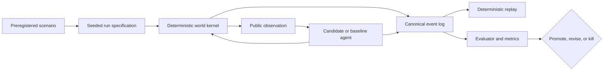

# ViabilityGrid

ViabilityGrid is a deterministic laboratory for deciding whether a proposed
cognitive mechanism is useful—or merely more complicated than its baseline.

## Aim

This repository asks one deliberately narrow question:

> Under the conditions a cognitive primitive claims to address, does it cause
> a reproducible improvement in regulation, calibration, adaptation, or
> value-per-compute over a simpler alternative?

The aim is not to assemble a convincing artificial mind. It is to turn ideas
such as predictive control, typed error, curiosity, appraisal, memory, and
metacontrol into separable engineering hypotheses with ways to fail.

A primitive earns promotion only when a preregistered experiment shows a
meaningful paired-seed effect, its ablation removes that effect, safety metrics
remain acceptable, and the gain justifies its compute cost. Otherwise it is
revised or killed. A milestone therefore closes with an evidence verdict, not
with a declaration of success.

## What this is—and is not

ViabilityGrid is an experimental harness with a small partially observable
world, explicit resource limits, replaceable candidate modules, simple
baselines, and an evaluator kept outside the agent boundary. It is designed to
answer causal comparison questions rather than produce an impressive demo.

It makes no consciousness claim, maps no software box directly to anatomy,
places no LLM in the core loop, and introduces no neural model before an exact
or tabular baseline proves insufficient. Hidden world truth is evaluator-only;
candidate modules receive immutable messages rather than privileged state.

## Experimental shape

The planned loop is intentionally auditable from specification to verdict:



The diagram is the target experiment topology, not a claim that every box is
already implemented. Work lands in dependency order so later results rest on
qualified reproducibility rather than retrofitted instrumentation.

## What exists now

Package `0.3.0` contains the Milestone 0 substrate through MW-003:

- CPython 3.14.7 free-threaded is the primary locked runtime, with exact
  conventional 3.14.7 retained as a compatibility lane.
- `cmw.contracts` defines 15 immutable, versioned, provenance-aware component
  messages with deterministic abstract costs and canonical JSON.
- `cmw.rng` derives independent named streams for the world, observations, and
  candidate modules from `sha256(f"{root_seed}:{stream_name}")`.
- `cmw.events` canonically serializes ordered events and state updates.
- `cmw.replay` reconstructs terminal state from the event log and verifies the
  manifest, each event, the whole log, and terminal-state SHA-256 digests.

The world kernel, scenario library, telemetry metrics, baselines, and oracle
comparison are still ahead. MW-004, the pure viability-world transition, is
next.

## Try deterministic replay

`uv` installs the required `3.14.7t` interpreter from `.python-version` when
needed. The demo is domain-neutral: it qualifies the replay substrate without
pretending the MW-004 world already exists.

```bash
uv sync --locked --all-groups
cmw_demo_dir="$(mktemp -d)/run"
uv run --locked python -m cmw.replay --write-demo "$cmw_demo_dir"
uv run --locked python -m cmw.replay "$cmw_demo_dir"
```

Both replay commands emit the same event-log and terminal-state hashes with
`"matched": true`. Changing a canonical event, manifest, terminal state, or
recorded summary makes replay exit non-zero.

## Design commitments

- Randomness is explicit and stream-local; module-global randomness is banned.
- Runs are event-sourced, canonically hashed, and replayable without wall time.
- Primitive boundaries are frozen typed messages, not shared implementation
  state.
- Every promoted primitive retains a simpler baseline and an ablation path.
- Concurrency is across isolated scenario/seed/variant runs only. A tick and an
  episode remain single-threaded, and scheduling never enters behavioral
  digests.
- Metrics are declared before benchmark runs and computed from observable
  events rather than primitive internals.

These constraints are experiment controls: relaxing one can make an apparent
algorithmic gain indistinguishable from a changed world realization, leaked
ground truth, hidden compute, or measurement drift.

## Validate the laboratory

Every commit must pass the locked environment, static analysis, all test tiers,
package build, and evidence-graph validation:

```bash
uv run --locked ruff check src tests
uv run --locked ty check
uv run --locked pytest
uv build
uv run --locked python knowledge/validate_graph.py \
    knowledge/cognitive-miniworld-knowledge-graph.jsonld
```

Focused tiers are available with `pytest -m property`, `pytest -m replay`,
`pytest -m freethreaded`, and `pytest -m performance`.

## Project map

```text
EPIC-001-cognitive-miniworld.md   hypotheses, architecture, work packages, gates
KICKOFF.md                       active milestone scope and dependency order
CLAUDE.md                        implementation invariants and working agreement
knowledge/                       evidence graph, bounded claims, validator
src/cmw/                         executable experimental substrate
tests/                           unit, property, replay, and runtime gates
docs/adr/                        accepted architectural decisions
docs/verdicts/                   per-work-package and milestone evidence
```

The [EPIC](EPIC-001-cognitive-miniworld.md) is the source of truth,
[KICKOFF](KICKOFF.md) bounds the current mission, and
[GORDIAN](https://github.com/users/kmosoti/projects/8) tracks delivery. The lab
stops at the Milestone 0 gate until deterministic replay and stable baselines
expose a measurable oracle gap on the demand-shift fixture.
