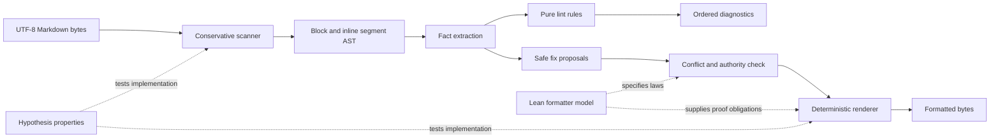

# Design proposal — deterministic prose linting and formatting

[Design index](../README.md) · [Lean model](Model.lean)

**Status:** design only. This proposal does not add a runtime dependency, a CI
gate, or an authorized implementation issue.

## Decision summary

Build the eventual prose tool as a deterministic, Markdown-aware Python CLI in
the repository's existing locked environment. Use Lean 4 as a design-time
specification and proof oracle for the formatter's algebraic laws, not as a
runtime or CI dependency.

This hybrid is preferable to implementing the operational tool in Lean:

- Python is already the hermetic project runtime and has approved property-test
  support through Hypothesis.
- Requiring Lean in CI would add a second toolchain and violate the current
  approved-dependency boundary without a dedicated decision.
- Lean is most valuable here where ordinary prose tooling is weakest: stating
  exactly what a safe formatter may change and proving the abstract transform
  terminates, preserves protected content, and reaches a fixed point.

The checked [`Model.lean`](Model.lean) uses only Lean's bundled `Std` library.
It was verified locally with Lean `4.24.0`; nothing in `pyproject.toml`,
`uv.lock`, or CI depends on it.

## Problem

Repository prose carries scientific claims, exact numbers, code, formulas,
links, Mermaid diagrams, and durable historical evidence. Generic formatters
usually optimize visual consistency but do not know which bytes are semantic.
A careless rewrite can:

- alter code, a command, a digest, a formula, or a link destination;
- turn a Markdown hard break into ordinary whitespace;
- reflow a table or Mermaid diagram into invalid syntax;
- change accepted verdict wording while claiming to be a style-only edit;
- oscillate between two formats or emit diagnostics in nondeterministic order;
- auto-correct a scientifically meaningful distinction such as “supports”
  versus “proves.”

The tool therefore needs a smaller authority than a general grammar editor. It
may normalize mechanically equivalent prose layout, diagnose risky language,
and enforce repository structure. It may not invent wording or silently change
scientific meaning.

## Goals

1. Parse enough Markdown structure to identify prose and byte-protected spans.
2. Produce stable rule IDs, source ranges, explanations, and optional fixes.
3. Apply only local, semantics-preserving fixes automatically.
4. Reflow eligible prose deterministically without changing token order.
5. Preserve code, formulas, link destinations, HTML, diagrams, and explicit
   hard breaks byte-for-byte.
6. Make formatter idempotence and protected-content preservation executable
   properties, with an abstract proof in Lean and concrete property tests in
   Python.
7. Remain dependency-free beyond the repository's approved Python toolchain.
8. Support human-readable and canonical JSON diagnostics for local use and CI.

## Non-goals

- judging whether a scientific claim is true;
- rewriting tone, voice, or argument structure;
- using an LLM, neural grammar model, or network service;
- automatically fixing passive voice, ambiguity, or epistemic overclaiming;
- replacing a full CommonMark conformance suite;
- modifying source code, generated evidence, ADR status, or verdict results;
- adding Lean, a Markdown package, or a pre-commit framework as a dependency in
  this proposal.

## Architecture



The operational pipeline has six boundaries:

1. **Decode:** accept valid UTF-8, normalize neither bytes nor newlines yet, and
   record exact byte and line offsets.
2. **Scan:** partition the document into Markdown blocks and inline segments.
3. **Protect:** mark syntax or payloads the formatter has no authority to edit.
4. **Analyze:** derive facts without mutating the tree.
5. **Plan:** rules emit diagnostics and optional nonoverlapping replacements.
6. **Render:** apply an ordered rewrite plan atomically and prove the result is a
   fixed point through tests.

No rule writes a file directly. Rules are pure functions from facts to
diagnostics. Only the renderer applies fixes.

## Markdown authority boundary

The scanner should be conservative: uncertain syntax becomes protected rather
than editable. Version 1 needs to recognize the repository's actual constructs,
not all possible Markdown extensions.

| Construct | Lint authority | Format authority |
| --- | --- | --- |
| Ordinary paragraph and heading text | Full configured prose diagnostics | Spacing and deterministic line reflow |
| List-item prose | Full diagnostics with indentation context | Reflow while preserving marker and continuation indent |
| Blockquote prose | Full diagnostics with quote depth | Reflow while preserving quote prefix |
| Table cell prose | Safe lexical diagnostics | No reflow in version 1 |
| Link label | Prose diagnostics | Local spacing only |
| Link destination/title | Link validity only | Byte-protected |
| Inline code and code fences | Fence-balance diagnostics | Byte-protected |
| Mermaid, shell, Python, JSON, and Lean fences | Fence-language diagnostics | Byte-protected |
| Math spans and blocks | Delimiter diagnostics | Byte-protected |
| HTML blocks/tags/comments | Directive validation only | Byte-protected |
| Markdown hard break (`␠␠\n` or `\\\n`) | Structural validation | Byte-protected boundary |
| ADR/verdict status and evidence values | Repository-specific checks | Never changed implicitly |

YAML front matter is protected if it appears at byte zero. An unclosed fence,
code span, HTML block, or math delimiter is a parse diagnostic and disables
formatting for that file; guessing would be unsafe.

## Core data model

The implementation should use immutable dataclasses or frozen msgspec-free
tooling records. It does not need production contracts because it is developer
tooling, but its values should remain explicit:

```text
SourceSpan(start_byte, end_byte, start_line, start_column,
           end_line, end_column)

Segment(kind, span, raw, tokens, children, protected)

Diagnostic(rule_id, severity, message, span, help, fix?)

Fix(start_byte, end_byte, replacement, authority, rule_id)

Document(path, source_sha256, newline_style, blocks)
```

Offsets used for edits are UTF-8 byte offsets. Human columns count Unicode
scalar values from one. Diagnostics sort by normalized repository-relative
path, start byte, severity, rule ID, and message. That order is independent of
filesystem enumeration and hash iteration.

## Rule model

Rules belong to an authority class. A class determines whether a diagnostic can
carry a fix.

### F — mechanically fixable

These rules may emit an edit when the scanner has an unambiguous prose span:

| Rule | Meaning |
| --- | --- |
| `F001` | Trailing horizontal whitespace, except an explicit Markdown hard break |
| `F002` | Repeated ordinary spaces between prose tokens |
| `F003` | Missing or repeated space after sentence punctuation in prose |
| `F004` | Space before ordinary comma, semicolon, colon, question mark, or exclamation mark |
| `F005` | More than one terminal newline |
| `F006` | Eligible prose exceeds configured width and can be greedily reflowed without crossing a protected boundary |

Fixes are intentionally ASCII-conservative. Version 1 does not replace quotes,
dashes, ellipses, nonbreaking spaces, or Unicode punctuation automatically.
Those may be meaningful in formulas, names, quotations, or copied evidence.

### M — Markdown structure

These rules diagnose document structure. Only a subset is fixable:

| Rule | Meaning | Fixable |
| --- | --- | --- |
| `M001` | Unclosed or mismatched protected delimiter | No |
| `M002` | Heading level jumps by more than one | No |
| `M003` | Duplicate explicit heading anchor | No |
| `M004` | Local Markdown link target does not exist | No |
| `M005` | Blank-line convention around headings, lists, tables, and fences | Yes when unambiguous |
| `M006` | List continuation indentation is inconsistent | No in version 1 |

### P — prose quality

These rules are advisory because a mechanical rewrite would require semantic
judgment:

| Rule | Meaning |
| --- | --- |
| `P001` | Consecutive duplicate word outside a quotation or code span |
| `P002` | Sentence exceeds the configured advisory token count |
| `P003` | Paragraph exceeds the configured advisory sentence count |
| `P004` | Ambiguous leading demonstrative such as “This” without a nearby noun |
| `P005` | Passive-voice heuristic matched; human review requested |
| `P006` | Acronym is used before its first local expansion |

`P004` and `P005` must remain low-severity hints. Their false-positive rate is
too context-sensitive for CI enforcement or auto-fixing.

### E — evidence and epistemic discipline

These rules encode ViabilityGrid documentation conventions without pretending
to verify truth:

| Rule | Meaning |
| --- | --- |
| `E001` | A dossier parent is missing `Thesis`, `Design`, or `Observations` |
| `E002` | A milestone number or exact confirmatory result lacks a nearby verdict/ADR link |
| `E003` | “Proves,” “guarantees,” or “validates” appears without an explicit scope phrase |
| `E004` | A historical test count is described as current, or vice versa |
| `E005` | MW-040 is presented as part of the M1 scientific evidence boundary |
| `E006` | Accepted result, current implementation, and interpretation are conflated in a dossier |

These are initially advisory and never auto-fix. Each message must explain the
expected evidence boundary rather than merely ban a word.

### T — project terminology

A small explicit lexicon may pin case and spelling for terms such as
`ViabilityGrid`, `GORDIAN`, `CPython`, `Lean 4`, `SHA-256`, `Brier`,
`BeliefState`, and `PredictionDistribution`. The lexicon must be reviewed data,
not a probabilistic spell checker. General spelling remains outside version 1.

## Formatter contract

Let `parse` produce a document AST, `format` canonicalize editable layout, and
`render` produce bytes. For every parseable input in the supported subset, the
formatter must satisfy:

```text
Idempotence
  render(format(parse(render(format(parse(input))))))
    = render(format(parse(input)))

Protected-byte preservation
  protectedProjection(format(parse(input)))
    = protectedProjection(parse(input))

Content preservation
  proseTokenProjection(format(parse(input)))
    = proseTokenProjection(parse(input))

Fix closure
  fixableDiagnostics(format(parse(input))) = []

Structural preservation
  markdownSkeleton(format(parse(input)))
    = markdownSkeleton(parse(input))
```

“Content preservation” deliberately allows whitespace and line boundaries to
change only between the same ordered prose tokens. It does not authorize token,
punctuation, link, code, formula, or block-order changes.

### Reflow algorithm

Reflow is greedy and deterministic:

1. preserve the block prefix and calculate its continuation indentation;
2. preserve protected inline spans as indivisible tokens;
3. add the next token if the line remains within the configured width;
4. otherwise break before it, unless it is the first token on the line;
5. allow a single unbreakable token to exceed the width;
6. never cross a hard break, table-cell boundary, HTML boundary, or directive.

Width is measured in Unicode scalar values, not terminal display cells, so the
same bytes produce the same result on every platform without another Unicode
width dependency. The default can match Ruff's 88-column convention, but line
width is configuration rather than scientific evidence.

## Formal reasoning plan

Lean does not prove that an arbitrary Python Markdown scanner is correct. It
can make the intended transform precise, prove useful laws for that model, and
expose which implementation claims still require conformance tests.

### Abstract model

[`Model.lean`](Model.lean) partitions a document into:

- editable prose segments, represented by ordered tokens and explicit gap
  widths; and
- opaque segments, represented by a protected kind and raw bytes.

The abstract formatter maps every prose gap to its canonical width and leaves
opaque segments unchanged. Structural recursion supplies termination.

The checked model proves:

| Theorem | Meaning |
| --- | --- |
| `formatSegment_idempotent` | A canonicalized segment is a fixed point |
| `format_idempotent` | Formatting the whole document twice equals formatting once |
| `content_preserved` | Prose token order and protected raw content are unchanged |
| `protected_preserved` | Protected kind/byte projection is unchanged |
| `format_is_clean` | Every formatter-fixable gap is canonical afterwards |

### Hoare-style obligations

The implementation should be reviewed against these triples:

```text
{ validUtf8(input) }
scan(input)
{ concat(rawBytes(segments)) = input ∧ spansPartition(input) }

{ parsed(document) ∧ nonOverlapping(fixes) ∧ fixesWithinAuthority(fixes) }
applyFixes(document, fixes)
{ protectedProjection(result) = protectedProjection(document) }

{ parsed(document) }
format(document)
{ canonical(result) ∧ sameSkeleton(result, document)
  ∧ sameTokens(result, document) ∧ format(result) = result }

{ parsed(document) }
lint(format(document))
{ noFixableDiagnostics(result) }
```

### Loop invariants

Although the Lean reference uses structural recursion, the Python scanner and
renderer will use loops. Their invariants should be explicit in code comments
and tests.

Scanner loop at byte cursor `i`:

```text
0 ≤ i ≤ len(input)
every emitted span ends at or before i
emitted spans are ordered, adjacent, and nonoverlapping
concat(emitted.raw) ++ input[i:] = original input
i is a UTF-8 code-point boundary
scanner state fully describes any open protected delimiter
```

Fix-application loop over edits sorted by `(start, end, rule_id)`:

```text
cursor = end of the last applied source span
all applied edits end at or before cursor
no unapplied edit begins before cursor
output = correctly rewritten source prefix [0:cursor]
no applied edit intersects a protected source span
```

Greedy reflow loop over prose tokens:

```text
flatten(completed_lines ++ current_line ++ remaining) = original token order
every completed line respects width unless it contains one unbreakable token
current indentation equals the block's canonical continuation prefix
no completed line crosses a protected or hard-break boundary
```

Mathematical induction over segments proves content/protected preservation;
induction over ordered fixes proves nonoverlap and prefix correctness; induction
over tokens proves reflow order preservation. A decreasing byte cursor, fix
count, or token count supplies termination for each algorithm.

## Bridging Lean and Python

The proof model and runtime can drift unless they share observable fixtures.
Use a small canonical JSON witness format in tests:

```json
{
  "segments": [
    {"kind": "prose", "tokens": ["M1", "passed"], "gaps": [3]},
    {"kind": "codeFence", "raw": "```bash\\nuv run pytest\\n```"}
  ]
}
```

The Python implementation should emit this witness in a debug mode. Approved
Hypothesis tests then check the four model laws directly on Python values. When
Lean is installed, an optional developer command can compile the model and
compare a corpus of witnesses. CI does not need Lean to enforce the same
properties against the operational implementation.

This is refinement testing, not a claim that the abstract Lean theorem
automatically verifies Python bytecode.

## CLI design

Proposed commands:

```bash
# Human-readable diagnostics; never edits.
uv run --locked python tools/prose.py check README.md CLAUDE.md docs

# Canonical JSON for CI or editor integration.
uv run --locked python tools/prose.py check --output json docs

# Report whether explicit files would change; never edits.
uv run --locked python tools/prose.py format --check docs/dossiers

# Format only explicitly named files/directories.
uv run --locked python tools/prose.py format docs/dossiers

# Explain one stable rule and its authority.
uv run --locked python tools/prose.py explain E003
```

`check` may discover the configured repository corpus. `format` must require at
least one explicit path and refuse generated or binary files. Writes use a
same-directory temporary file, flush and close it, then replace the original
only after reparsing and checking formatter invariants. A failure leaves the
original file untouched.

Exit codes:

| Code | Meaning |
| ---: | --- |
| `0` | No diagnostics at the configured failure severity; format check clean |
| `1` | Lint diagnostics or formatting differences found |
| `2` | Invalid UTF-8, parse ambiguity, invalid configuration, conflicting fixes, or internal invariant failure |

Configuration belongs under `[tool.cmw-prose]` in `pyproject.toml` only when an
implementation issue is authorized. `tomllib` can read it without a new
dependency. Rule selection and severity must be explicit and deterministic.

Inline suppressions use HTML comments because they are already protected
Markdown syntax:

```markdown
<!-- cmw-prose: disable P002 -- reason: canonical legal wording -->
...
<!-- cmw-prose: enable P002 -->
```

A suppression without a nonempty reason is itself a diagnostic. Suppressions
cannot disable parser safety, protected-byte preservation, conflicting-fix, or
internal-invariant errors.

## Complexity and determinism

For `n` input bytes and `r` emitted fixes:

- scanning and fact extraction should be `O(n)`;
- rule passes should be `O(n)` or explicitly bounded by local block size;
- sorting fixes and diagnostics should be `O(r log r)`;
- rendering should be `O(n + replacement_bytes)`;
- the tool remains single-threaded so worker scheduling cannot affect ordering;
- filesystem traversal is normalized and sorted before file processing;
- source SHA-256 and normalized configuration identify a check run;
- wall time may be printed diagnostically but never enters output identity.

Complexity tests should count scanner steps and rule visits instead of asserting
machine timing. Adversarial inputs—long delimiter runs, nested brackets, large
tables, and many links—must not trigger regex backtracking or quadratic rescans.

## Rollout

### Phase 0 — design and corpus

- approve a dedicated GORDIAN work item and ADR if this becomes a CI gate;
- freeze representative Markdown fixtures from README, dossiers, ADRs,
  verdicts, tables, Mermaid, math, and malformed inputs;
- decide which files are linted and which may be formatted.

### Phase 1 — parser, fix engine, and safe rules

- implement scanner, source spans, deterministic diagnostics, `F001`–`F006`,
  `M001`, `M004`, and `M005`;
- add golden round-trip tests and Hypothesis preservation/idempotence tests;
- run in report-only mode and fix the corpus manually or with reviewed edits.

### Phase 2 — evidence-aware rules

- implement dossier shape, evidence-link, historical/current, and M1/MW-040
  boundary checks;
- keep semantic heuristics advisory;
- collect false positives before setting any failure severity.

### Phase 3 — CI enforcement

- enforce parse safety, protected preservation, local links, formatter
  idempotence, and mechanically fixable rules;
- keep passive voice, ambiguity, and epistemic-language heuristics advisory;
- prove actual CI selection if multiple prose tiers are introduced, following
  ADR-020's collected-manifest approach rather than parsing workflow text.

Lean compilation remains an optional developer verification unless a later ADR
explicitly approves the toolchain in CI.

## Acceptance criteria for an implementation issue

An implementation is ready to propose for enforcement only when all of the
following hold:

1. No production or development dependency is added beyond the approved list.
2. Every supported document round-trips byte-for-byte when no fix applies.
3. Property tests generate mixed prose/protected documents and establish
   idempotence, token preservation, protected-byte preservation, and fix
   closure.
4. Malformed or ambiguous Markdown disables formatting and exits `2` without a
   partial write.
5. Overlapping nonidentical fixes fail closed and identify both rule IDs.
6. Diagnostics and JSON bytes are identical across repeated runs and supported
   CPython GIL modes.
7. The full repository corpus has zero enforced diagnostics; advisory findings
   are reviewed and recorded separately.
8. Local-link checks understand repository-relative paths and heading anchors.
9. Formatter mutation tests demonstrate that breaking each invariant causes a
   test failure.
10. Scanner step-count tests remain linear on the declared adversarial corpus.
11. `Model.lean` compiles without `sorry` under the recorded Lean toolchain, and
    Python property tests cover the same four named laws.
12. Existing Ruff, ty, pytest, build, and knowledge-graph gates remain green.

## Open decisions for the authorized issue

- Should ADRs and verdicts be format-protected by default, with lint-only
  authority unless explicitly named?
- Should line width be 88 everywhere or vary for tables and blockquotes?
- Which `E` rules should ever block CI, and what reviewed corpus establishes an
  acceptable false-positive rate?
- Should heading-anchor validation follow GitHub's exact slug algorithm or
  require explicit anchors when ambiguity exists?
- Does the tool live under `tools/` as developer infrastructure or under
  `src/cmw/` with a console entry point? The former keeps it out of the
  experimental package; the latter gives normal typing and packaging.
- Should the optional Lean witness checker remain a documentation artifact or
  become a separately versioned developer tool?

The recommended first implementation is conservative: `tools/prose.py`,
explicit paths for formatting, all protected syntax immutable, no semantic
auto-fixes, and only structural/mechanical rules enforced.
