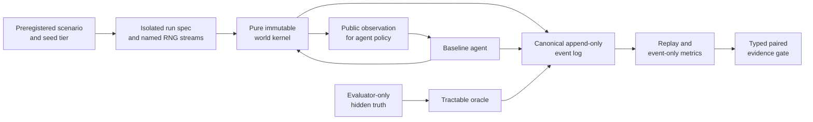

# M0 overview — a qualified experimental laboratory

[All dossiers](../README.md) · [Science deep dive](science.md) ·
[Engineering deep dive](engineering.md)

M0 establishes that ViabilityGrid can make a cognitive-mechanism comparison
worth believing. It delivers the substrate from repository and runtime through
typed evidence evaluation, then closes on a deliberately modest empirical
claim: the canonical world contains a reproducible, measurable opportunity for
improvement over a simple public-information baseline.

| Attribute | M0 boundary |
| --- | --- |
| Status | Accepted on 2026-08-27 |
| Work packages | MW-001 through MW-007 |
| Closing package | `0.7.0` |
| Research gate | Deterministic replay plus a stable, meaningful evaluator-only oracle gap |
| Confirmatory fixture | `demand_shift` |
| Primary result | Oracle-minus-baseline viability AUC `0.039634146341463394` |
| Minimum meaningful effect | `0.02` |
| Scientific meaning | The laboratory has measurable headroom; no cognitive candidate is validated |

## Thesis

Before asking whether memory, prediction, appraisal, or metacontrol helps, the
laboratory must rule out easier explanations for an apparent gain. A result is
not interpretable if two variants see different random worlds, if an agent can
read evaluator truth, if parallel scheduling changes behavior, if metrics peek
at mutable state, or if an evidence file cannot be replayed.

M0's thesis is therefore:

> If every run is generated from a frozen public specification, isolated named
> random streams, immutable transitions, and canonical events, then a paired
> baseline-versus-oracle effect can qualify both reproducibility and available
> experimental headroom without crediting any cognitive mechanism.

This is a laboratory-qualification thesis. It intentionally precedes the first
cognitive primitive.

## Design

M0 is a chain of trust. Each layer narrows what the next layer is allowed to
assume, and the evaluator receives more information than the agent only at an
explicit, tested boundary.

The baseline and oracle are paired by scenario, seed, and comparison identity.
The oracle may use hidden truth to estimate headroom, but it lives in evaluator
code and is never exported as an agent policy.

## What M0 delivers

| Work package | Delivery | Durable evidence |
| --- | --- | --- |
| MW-001 | Hermetic package, locked CPython runtime, quality gates, free-thread correctness and scaling lane | [Verdict](../../verdicts/MW-001.md) |
| MW-002 | Fifteen immutable, versioned, provenance-aware canonical contracts | [Verdict](../../verdicts/MW-002.md) |
| MW-003 | SHA-256-derived named RNG streams, canonical events, deterministic replay, tamper rejection | [Verdict](../../verdicts/MW-003.md) |
| MW-004 | Pure grid-world transition kernel, conservation, delayed effects, bounded resources, public observations | [Verdict](../../verdicts/MW-004.md) |
| MW-005 | Strict scenario manifests, typed schedules, seven fixtures, and smoke/CI/benchmark seed tiers | [Verdict](../../verdicts/MW-005.md) |
| MW-006 | Agent/evaluator telemetry isolation, bounded canonical JSONL, event-only metrics, nondigested runtime diagnostics | [Verdict](../../verdicts/MW-006.md) |
| MW-007 | Closed baseline registry, evaluator-only demand-shift oracle, paired parallel runner, bootstrap statistics, typed M0 gate | [Verdict](../../verdicts/MW-007.md) |

Together these produce a reusable experimental grammar:

`scenario → run → public policy → canonical events → replay → paired metrics → verdict`

Later milestones can replace the public policy without changing the world
realization, measurement rule, or evaluator boundary.

## Observations

### The gate passed for the intended reason

Across paired seeds 1000–1099, baseline mean viability AUC was
`0.1480487804878049`; the evaluator-only oracle reached
`0.1876829268292683`. The mean paired effect was
`0.039634146341463394`, nearly twice the preregistered minimum effect. Both arms
recorded zero irreversible errors. The complete accepted result is preserved in
the [M0 verdict](../../verdicts/M0.md).

Every seed produced the same paired difference, so the deterministic 95%
percentile-bootstrap interval collapsed to
`[0.039634146341463346, 0.039634146341463346]`. That is a property of this
fixture and policy pair, not evidence that bootstrap uncertainty is generally
zero.

### Reproducibility is behavioral, not temporal

Serial, two-worker, and four-worker execution produced identical ordered
behavioral evidence. Wall time is recorded only as runtime diagnostics and
never enters a behavioral digest. Concurrency is allowed across isolated
`(scenario, seed, variant)` runs; a tick and an episode remain single-threaded.

### The oracle gap is a ruler, not a candidate

The M0 result says the world is neither already solved by the baseline nor so
unstructured that privileged planning finds no gain. It provides a measurable
target for later mechanisms. It does not show that prediction, memory, or any
other candidate can capture that gap under the public-information constraint.

### Performance fixes preserved the experiment

The accepted [M0 optimization](../../verdicts/M0-optimization.md) removed
quadratic manifest validation, improved 10,000-item validation from about
`2.62 s` to `0.016 s` (about `162×`), and made the observed exponent nearly
linear (`1.98 → 1.05`). It also made CI tier selection executable from pytest's
actual collected node IDs. Behavioral results and the benchmark definition did
not change.

## What M0 establishes—and what it does not

| Level | Statement |
| --- | --- |
| Established | Frozen inputs replay; canonical evidence detects tampering; agent and evaluator channels remain separated; serial and supported worker counts agree; the demand-shift oracle gap exceeds `0.02`. |
| Supported interpretation | The lab has enough controlled headroom to test whether a public cognitive mechanism earns complexity. |
| Not established | General benchmark validity, optimality of the oracle outside its enumerated family, usefulness of any later primitive, biological plausibility, consciousness, or general intelligence. |

## Continue reading

- [M0 science](science.md) reconstructs the hypothesis, operationalized
  viability, paired design, bootstrap gate, result, and validity limits.
- [M0 engineering](engineering.md) traces the contracts, deterministic kernel,
  replay, telemetry, bounds, concurrency, tests, and ADRs that make the result
  auditable.
- [M0 milestone verdict](../../verdicts/M0.md) is the frozen result record.
