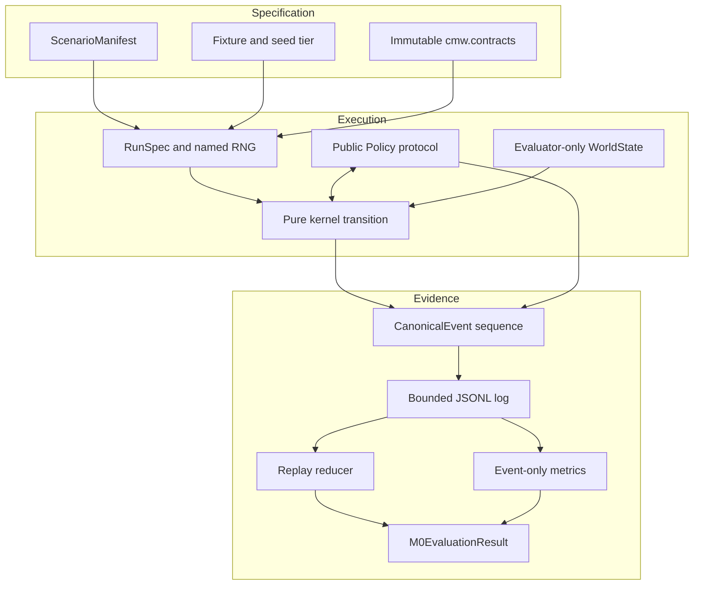

# M0 engineering — the chain of experimental trust

[M0 overview](README.md) · [Science deep dive](science.md) ·
[All dossiers](../README.md)

M0's engineering contribution is not one subsystem. It is a set of boundaries
that make an experiment reconstructable: frozen messages, explicit randomness,
a pure kernel, declarative scenarios, isolated telemetry, registered policies,
bounded execution, and typed evidence.

## Architecture



The key property is directional authority. Scenario data configures the world;
the world emits a public projection; agent policies return decisions; canonical
events become the sole behavioral record; evaluator code derives metrics and a
verdict. No later layer mutates an earlier record.

## Delivery by layer

### 1. Hermetic runtime and quality gates — MW-001

The repository is a standalone `uv` package with a locked dependency graph.
CPython `3.14.7t` is the primary runtime; exact CPython `3.14.7` with the GIL is
retained as a compatibility lane. The free-threaded uplift verified 2,000
concurrent contract round trips and observed median scaling of `1.393 s`,
`0.765 s`, and `0.524 s` for one, two, and four isolated workers.

Concurrency is constrained to independent runs. It is never used inside a tick
or episode, and thread scheduling is excluded from canonical evidence.

Relevant surfaces: [`pyproject.toml`](../../../pyproject.toml),
[`uv.lock`](../../../uv.lock), [quality-gate tests](../../../tests/test_quality_gates.py),
and [free-thread tests](../../../tests/test_free_threading.py).

### 2. Canonical component contracts — MW-002

[`cmw.contracts`](../../../src/cmw/contracts/__init__.py) defines fifteen
frozen, keyword-only, versioned message types. They carry provenance,
uncertainty, deterministic `unit_cost`, and canonical JSON-compatible data.
Unknown fields, nonfinite floats, negative zero where canonical zero is
required, unsorted identifiers, invalid probabilities, and broken
cross-references fail at construction or decode.

Contracts are the seams between primitives. Code exchanges `BeliefState`,
`PredictionDistribution`, `ActionProposal`, `ErrorBundle`, `ActionDecision`,
and related records instead of sharing mutable implementation objects.

### 3. Named randomness, events, and replay — MW-003

[`cmw.rng`](../../../src/cmw/rng.py) derives a stream seed from
`sha256(f"{root_seed}:{stream_name}")` and advances it with a deterministic
SplitMix64 generator. Each run owns mutable stream continuations, but snapshots
are frozen and serializable. Module-global `random`, `uuid`, and `numpy.random`
are banned by lint configuration.

[`cmw.events`](../../../src/cmw/events.py) defines canonical manifests, events,
terminal states, replay summaries, and reducers. Event sequences must begin at
zero, remain contiguous, and use monotonic ticks. [`cmw.replay`](../../../src/cmw/replay.py)
recomputes event, log, terminal-state, and summary digests and rejects changed
bytes or semantics.

### 4. Pure world kernel — MW-004

[`cmw.kernel`](../../../src/cmw/kernel/__init__.py) applies a decision to an
immutable evaluator-owned `WorldState` and returns a new state plus public
observations and canonical state updates. The kernel enforces:

- bounded energy, integrity, grid positions, and action costs;
- exact conservation of consumable resource units;
- deterministic delayed effects;
- hard terminal floors and normalized viability bounds;
- four public observation channels with explicit reliability and latency;
- absence of policy imports from the kernel architecture.

The agent never receives `WorldState`. That type is evaluator-only even though
the public observations it produces are deterministic functions of state and an
explicit observation RNG continuation.

### 5. Declarative scenarios — MW-005

[`cmw.scenarios`](../../../src/cmw/scenarios/__init__.py) supplies frozen
manifests, a strict canonical decoder, an agent-safe projection, typed schedules,
and seven first-wave fixtures. A manifest is data, not executable policy. It
declares grid and resource configuration, action rules, hidden parameters,
public stimuli, metrics, seed tiers, and scheduled changes.

Smoke, CI, and benchmark tiers use 5, 20, and 100 seeds. Demand, transition,
sensor reliability, hazard, resource, stimulus, and habit changes apply at the
start of their declared tick, including ticks inside multi-tick actions.

The current trust boundary rejects oversized inputs before compilation:
at most 4,096 seeds, a 100,000-tick horizon, a 256-cell grid side, 100,000
scheduled changes, 100,000 stimuli, and a 4 MiB manifest.

### 6. Telemetry and event-only metrics — MW-006

[`cmw.telemetry`](../../../src/cmw/telemetry/__init__.py) classifies events into
agent and evaluator channels, rejects evaluator truth in agent events, and
stores canonical events in an append-only JSONL file created with exclusive
mode. Current bounds are one million events, 1 MiB per line, and 512 MiB per
log.

The log is the source of truth for replay and metrics. Viability AUC, time
outside viability, irreversible errors, and episode ticks are recomputed from
events. Runtime diagnostics such as elapsed wall time may be reported, but they
are outside the behavioral digest.

Relevant modules: [channel isolation](../../../src/cmw/telemetry/channels.py),
[event log](../../../src/cmw/telemetry/event_log.py),
[metrics](../../../src/cmw/telemetry/metrics.py), and
[run reports](../../../src/cmw/telemetry/report.py).

### 7. Baselines, oracle, runner, and gate — MW-007

The public [`Policy` seam](../../../src/cmw/experiments/runner.py) allows a
baseline or later candidate to consume the same observation stream. The closed
agent registry exposes simple controllers and ablations; unknown names fail
instead of silently selecting a default. The evaluator-only
[`DemandShiftOracle`](../../../src/cmw/experiments/oracle.py) remains outside the
agent package and exhausts a bounded family for horizons no greater than 256.

`RunSpec` and `RunResult` make run identity explicit. The runner rejects work
before allocating a world or worker when batch, worker, horizon, schedule, or
stimulus bounds are exceeded. Current maxima include 4,096 runs, 64 workers,
10,000 ticks per run, and 100,000 aggregate batch ticks.

The typed [`M0 evaluator`](../../../src/cmw/experiments/m0.py) accepts completed
run records rather than loose metric vectors. It verifies frozen fixture and
analysis configuration, exact pairing, policy identity, replay, event-derived
metrics, bootstrap continuation, and safety before canonical evidence encoding.

## Determinism invariants

| Invariant | Enforcement |
| --- | --- |
| Same identity, same randomness | Root seed plus stable stream name; snapshots are explicit evidence |
| One mechanism cannot perturb another's draw order | Independent named streams for world, observation, analysis, and candidate mechanisms |
| Same values, same bytes | Deterministic msgspec encoding, sorted identifiers, finite canonical scalars |
| Same events, same terminal state | Pure reducer and terminal-state digest |
| Same run under different worker counts | Workers execute isolated run specs; ordered aggregation is canonical |
| Metrics cannot inspect internals | Metric functions accept canonical events only |
| Timing cannot change behavior | Abstract compute units and implicit wait ticks; wall time excluded from digests |
| Evidence cannot be overwritten accidentally | Event/evidence destinations use exclusive creation |

## Optimization without semantic drift

The M0 optimization addressed two scaling problems while preserving the gate:

- manifest validation moved from repeated prefix/set reconstruction to linear
  scans, improving a 10,000-item case from about `2.62 s` to `0.016 s` and the
  fitted exponent from `1.98` to `1.05`;
- CI marker coverage stopped parsing source text and instead proves that the
  union of pytest's actual selected node manifests covers the full suite;
- the performance marker remains off the pull-request execution path while its
  coverage is still checked;
- a shorter thread-pool scaling probe was tried and reverted because worker
  startup dominated on the measured four-vCPU environment.

The [optimization verdict](../../verdicts/M0-optimization.md) records the
before/after evidence and the retained probe.

## Validation and reproduction

Run the complete current repository gate:

```bash
uv run --locked ruff check src tests
uv run --locked ty check
uv run --locked pytest
uv build
uv run --locked python knowledge/validate_graph.py \
  knowledge/cognitive-miniworld-knowledge-graph.jsonld
```

At this dossier's source revision, pytest collects 528 tests across M0, M1, and
the adjacent MW-040 work. Historical evidence remains slice-specific: the M0
milestone verdict closed after 370 tests; the accepted M0 optimization recorded
385. Later tests strengthen the current code but do not rewrite the historical
decision.

Exercise canonical replay independently:

```bash
cmw_demo_dir="$(mktemp -d)/run"
uv run --locked python -m cmw.replay --write-demo "$cmw_demo_dir"
uv run --locked python -m cmw.replay "$cmw_demo_dir"
```

The two replay summaries should report matching event-log and terminal-state
hashes. Any changed canonical event, manifest, summary, or terminal state must
make replay fail.

## Decision record map

| Decision | Engineering commitment |
| --- | --- |
| [ADR-001](../../adr/ADR-001.md) | Python reference before Rust optimization |
| [ADR-002](../../adr/ADR-002.md) | Explicit RNG streams and event-sourced replay |
| [ADR-003](../../adr/ADR-003.md) | Immutable typed contracts between primitives |
| [ADR-004](../../adr/ADR-004.md) | Canonical JSONL source; columnar analytics only derived |
| [ADR-005](../../adr/ADR-005.md) | No LLM in the core cognitive loop |
| [ADR-006](../../adr/ADR-006.md) | No emotion enums as direct control inputs |
| [ADR-007](../../adr/ADR-007.md) | Typed error vector rather than one global scalar |
| [ADR-008](../../adr/ADR-008.md) | Baseline, ablation, oracle, and kill test for promotion |
| [ADR-009](../../adr/ADR-009.md) | Biological evidence and engineering analogy remain distinct |
| [ADR-010](../../adr/ADR-010.md) | Hermetic repository and dependency boundary |
| [ADR-011](../../adr/ADR-011.md) | Operational viability definition |
| [ADR-012](../../adr/ADR-012.md) | Deterministic compute–time coupling |
| [ADR-013](../../adr/ADR-013.md) | Attempted-versus-executed agency error |
| [ADR-014](../../adr/ADR-014.md) | Typed reference-trajectory shape and deviation |
| [ADR-015](../../adr/ADR-015.md) | CPython 3.14.7t and run-level concurrency boundary |
| [ADR-016](../../adr/ADR-016.md) | Declarative scenario and schedule boundary |
| [ADR-017](../../adr/ADR-017.md) | Telemetry channel and digest boundary |
| [ADR-018](../../adr/ADR-018.md) | Baseline, oracle, and paired-run boundary |
| [ADR-019](../../adr/ADR-019.md) | Executable policy and evidence identity |
| [ADR-020](../../adr/ADR-020.md) | CI tier split and collected-node coverage proof |

These are controls, not ornament. Changing randomness, observation authority,
metric source, concurrency scope, cost accounting, or evidence identity can
change the meaning of an experiment and therefore requires an explicit new
decision record or preregistration.
