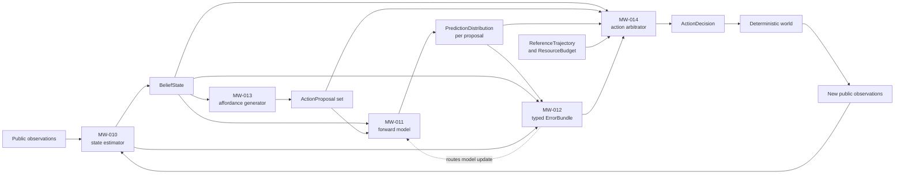

# M1 overview — the predictive-control spine

[All dossiers](../README.md) · [Science deep dive](science.md) ·
[Engineering deep dive](engineering.md)

M1 delivers ViabilityGrid's first complete candidate architecture: a bounded,
nonlinguistic loop that estimates hidden state from public evidence, proposes
possible actions, predicts their consequences, distinguishes kinds of error,
and chooses transparently under reference, risk, and resource constraints.

| Attribute | M1 boundary |
| --- | --- |
| Status | Closed through five accepted work packages on 2026-08-28 |
| Work packages | MW-010 through MW-014 |
| Closing package | `0.13.0` |
| Architecture | State estimator, forward model, typed error, affordance generator, action arbitrator |
| Closing comparison | Predictive arbitration versus reactive control on `delayed_poison` |
| Primary closing effect | Viability AUC improvement `0.02146341463414636` on every paired seed |
| Safety result | `0` irreversible consumes versus `200` for reactive control |
| Claim boundary | Narrow finite-state evidence; no general intelligence or broad-transfer claim |

## Thesis

A reactive controller can regulate what is immediately visible, but delayed
consequences and partial observability require distinctions that a single
stimulus-response rule cannot express. The agent must separate:

- what it believes is true from what it just observed;
- which actions remain possible from which action should win;
- what each action is predicted to cause from what later occurred;
- a model error from a control error, timing error, or agency failure;
- reference progress from risk, resource use, and information value.

M1's thesis is:

> A deterministic, typed predictive loop can use only public evidence to
> recover from hidden-state and dynamics errors, preserve parallel action
> possibilities, route disagreement correctly, and outperform a simpler
> reactive controller when consequences are delayed.

The thesis is tested as five separable hypotheses plus an executable
cross-primitive seam. No primitive earns credit solely because the final loop
works; each has its own baseline, failure mode, and accepted evidence.

## Design

The issue numbers follow delivery order, while the runtime loop follows data
dependency. Affordance generation (MW-013) occurs before action-conditioned
prediction; typed error (MW-012) is computed after new evidence arrives and
feeds the next arbitration and model-update cycle.

Every box at the agent boundary consumes and returns frozen public contracts.
Evaluator truth is used only by experiment code to score calibration,
feasibility, causal credit, viability, and regret.

## What M1 delivers

| Work package | Primitive | Accepted result | Durable evidence |
| --- | --- | --- | --- |
| MW-010 | Exact bounded tabular state estimator | Brier loss `0.1923106475855707` vs `0.31725000000000003`; reduction `0.12493935241442927`; stale `0.99` belief reversed in 3 ticks | [Verdict](../../verdicts/MW-010.md) · [ADR-021](../../adr/ADR-021.md) |
| MW-011 | Known and immutable learned tabular forward models | Pre/post-shift improvements `1.933333396911621` and `1.8667968432109774`; recovery in 2 ticks; delayed-policy gain `0.02146341463414636` | [Verdict](../../verdicts/MW-011.md) · [ADR-022](../../adr/ADR-022.md) |
| MW-012 | Seven-channel public typed-error decomposer | Typed credit precision `1.0` vs scalar `0.5`; viability AUC `0.225` vs `0.175`; no unnecessary typed control | [Verdict](../../verdicts/MW-012.md) · [ADR-024](../../adr/ADR-024.md) |
| MW-013 | Positive-support belief affordance generator | Feasible-best recall `1.0` vs `0.5`; invalid-action rate reduced by `0.14423076923076922`; incomplete evidence retained alternatives | [Verdict](../../verdicts/MW-013.md) · [ADR-023](../../adr/ADR-023.md) |
| MW-014 | Bounded transparent multiobjective arbitrator | Viability gain `0.02146341463414636`; no irreversible consumes; max oracle regret `0.02853658536585363` | [Verdict](../../verdicts/MW-014.md) · [ADR-025](../../adr/ADR-025.md) |

The public composition test in
[`test_predictive_spine.py`](../../../tests/agents/test_predictive_spine.py)
constructs all five primitives together. It traces estimate → generate →
predict → revise → compare → arbitrate → learn and verifies contract identities,
routing, reversible dominance, transparent rationale, uncertainty, and immutable
model update.

## Observations

### M1 closes a loop, not a monolith

Each primitive can be replaced behind an existing contract. The state estimator
does not choose an action; the affordance generator does not rank; the forward
model does not decide; the error decomposer does not mutate a model; the
arbitrator does not inspect hidden truth. This separation keeps later ablations
meaningful and prevents a successful end-to-end score from concealing which
mechanism mattered.

### Probability earns its keep twice

The estimator's calibrated posterior improves on copying the last observation,
and the forward model's action-conditioned distribution supports a better
delayed decision. Uncertainty is not decorative metadata: posterior support
controls which affordances remain possible, outcome probabilities determine
risk and entropy, and source confidence limits decision confidence.

### Missing evidence is not negative evidence

MW-013's positive-support rule excludes a proposal only when observable
preconditions are contradicted across the belief. An absent feature leaves the
action possible but unconfirmed. The result is deliberately asymmetric:
incomplete evidence can enlarge the candidate set and lower confidence instead
of silently erasing a feasible action.

### Typed disagreement changes behavior

Expected-but-undesirable outcomes require control correction without model
revision; unexpected-but-safe outcomes require model revision without an
unnecessary intervention. The scalar ablation cannot retain that causal
identity. M1 demonstrates that routing information, rather than error magnitude
alone, can improve the fixed safety adapter.

### The winning controller is conservative, not oracle-optimal

On `delayed_poison`, predictive arbitration chooses reversible waiting and
avoids the reactive controller's repeated irreversible consumes. The
evaluator-only oracle prefers one early consume because its immediate energy
gain outweighs later integrity damage under the declared viability metric.
M1 reports the candidate's nonzero regret instead of hiding it. Its maximum
`0.02853658536585363` stays below the `0.03` gate and below reactive regret.

### Repeated delayed-poison numbers are one evidence lineage

MW-011's evaluator-only predicted-safety selector and MW-014's reusable
arbitrator both realize the same all-wait behavior on the canonical fixture, so
both report viability AUC `0.14878048780487807` against reactive
`0.1273170731707317`. These results show that prediction utility survives into
the final controller; they should not be counted as two independent
replications of the same effect.

### MW-040 is adjacent, not part of the claim

Package `0.13.0` also contains episodic-memory work from MW-040, and
[ADR-027](../../adr/ADR-027.md) covers an optimization that touched both MW-014
and MW-040. MW-040 belongs to the later M4 memory milestone. It does not supply
the missing step in M1 and is excluded from every M1 scientific synthesis here.

## What M1 establishes—and what it does not

| Level | Statement |
| --- | --- |
| Established | Each finite primitive passed its frozen comparison; all five public contracts compose; the final delayed-consequence candidate beats reactive control on every paired seed while satisfying its safety and regret gates. |
| Supported interpretation | Explicit belief, prediction, possibility, error type, and value decomposition form a useful first predictive-control spine under partial observability and delay. |
| Not established | Broad environmental transfer, continuous or high-dimensional inference, long-horizon planning, learned references, action-conditioned information gain, general optimality, consciousness, or general intelligence. |

## Continue reading

- [M1 science](science.md) reconstructs all five preregistrations, algorithms,
  comparisons, accepted results, evidence digests, synthesis, and validity
  limits.
- [M1 engineering](engineering.md) documents the public contract seam,
  deterministic algorithms, resource bounds, validation boundaries,
  integration test, and extension rules.
- Issue verdicts [MW-010](../../verdicts/MW-010.md),
  [MW-011](../../verdicts/MW-011.md),
  [MW-012](../../verdicts/MW-012.md),
  [MW-013](../../verdicts/MW-013.md), and
  [MW-014](../../verdicts/MW-014.md) preserve the frozen evidence.
