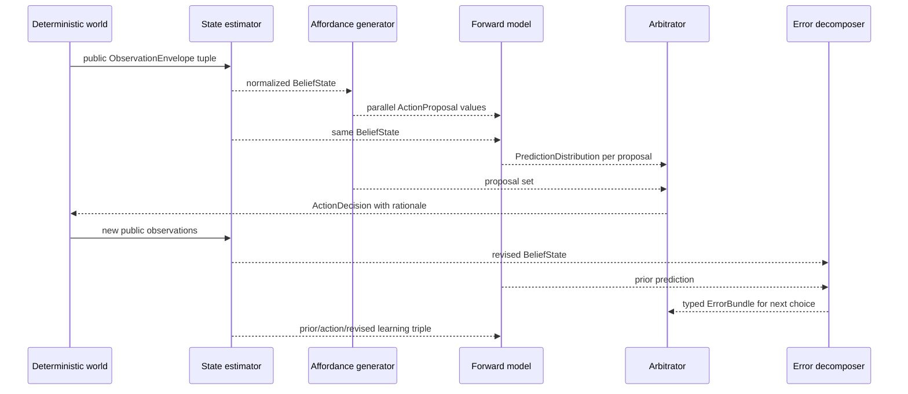

# M1 engineering — immutable contracts in a closed loop

[M1 overview](README.md) · [Science deep dive](science.md) ·
[All dossiers](../README.md)

M1 extends the qualified M0 laboratory without weakening its controls. Every
primitive is deterministic, finite, bounded, and agent-side. It receives only
public frozen messages and returns another existing contract with explicit
work, provenance, and uncertainty.

## Public contract seam

The supported surface is exported from
[`cmw.agents`](../../../src/cmw/agents/__init__.py). The integration flow is:

| Stage | Main implementation | Consumes | Produces | Critical invariant |
| --- | --- | --- | --- | --- |
| Estimate | [`estimation.py`](../../../src/cmw/agents/estimation.py) | `ObservationEnvelope`, optional prior `BeliefState`, previous decision | `BeliefState` | Hypotheses are canonical and probabilities normalize |
| Generate | [`affordances.py`](../../../src/cmw/agents/affordances.py) | `BeliefState`, declarative templates | `AffordanceGeneration` containing `ActionProposal`s | Positive support preserves possibility; generation does not select |
| Predict | [`forward_model.py`](../../../src/cmw/agents/forward_model.py) | `BeliefState`, `ActionProposal` | `PredictionDistribution` | One normalized action-conditioned distribution with matching IDs and horizon |
| Compare | [`errors.py`](../../../src/cmw/agents/errors.py) | Prediction, prior/revised beliefs, reference, observations, optional prior error | `ErrorBundle` | Seven fields remain separately computed and publicly attributable |
| Arbitrate | [`arbitration.py`](../../../src/cmw/agents/arbitration.py) | Belief, reference, proposal set, predictions, error, budget | `ArbitrationResult` and `ActionDecision` | Winner is eligible, undominated, canonically selected, and fully rationalized |
| Learn | [`forward_model.py`](../../../src/cmw/agents/forward_model.py) | Prior belief, executed proposal, revised belief | New `LearnedTabularForwardModel` | Update is immutable and provenance accumulates |

The contracts were delivered in M0, so M1 adds behavior without a schema
revision. This makes every primitive independently replaceable and prevents an
implementation from smuggling private state through an untyped return value.

## End-to-end lifecycle



The world transition and event log remain M0 responsibilities. M1 never imports
evaluator `WorldState`; experiment adapters own hidden latent traces,
feasibility labels, oracle policies, and scoring.

## Stage mechanics and bounds

### State estimator

`TabularStateVariable` accepts 2–16 immutable scalar values with type-strict
uniqueness, a probability strictly inside `(0, 1)` for persistence and sensor
accuracy, and an optional normalized prior. The joint state space is capped at
256. An update accepts at most 4,096 observations, at most 10,000 transition
steps, and at most 10,000,000 charged tabular work units.

The exact filter:

1. validates and canonically orders variables and evidence;
2. projects a prior or constructs the product prior;
3. advances probabilities across elapsed ticks;
4. marginalizes delayed evidence to the observation's effective tick;
5. applies reliability-capped emission likelihoods;
6. normalizes with `math.fsum` and emits sorted hypotheses, provenance, and
   entropy-aware uncertainty.

`LastObservationEstimator` remains the executable ablation. It carries the
newest feature by `(tick, event_id, position)` and intentionally has no hidden
mutable state.

### Forward models

`TabularPredictionState` names a canonical state with sorted unique features.
The known model requires a complete normalized transition table. The learned
model supports at most 64 states, 16 actions, 64 features per state, 256 belief
hypotheses, a 10,000-tick horizon, and 262,144 units of conservative belief
projection work.

Prediction first projects belief mass onto the configured finite states, then
mixes each source row for the proposal's action into normalized target
outcomes. The learned update applies the frozen recency-weighted count equation
only to the experienced action/source exposure and returns a replacement model.
It never edits the prior instance.

Provenance unions are bounded before deduplication so repeated input IDs cannot
hide excessive work. At most 10,000 source-event occurrences are admitted.

### Affordance generator

`AffordanceTemplate` is declarative: stable template ID, action, bounded
parameters, resource cost, reversibility, and up to 16 boolean observable
preconditions. The generator accepts at most 64 templates, 256 belief
hypotheses, 64 parameters per template, and 10,000 belief source-event IDs.
Maximum precondition work is explicit rather than inferred from wall time.

Support is evaluated jointly per hypothesis. A missing precondition contributes
possible mass but not confirmed mass; explicit false removes that hypothesis's
support. Generated proposals are canonical and parallel. `AffordanceCycleObservation`
can report generation or selection failure but cannot perform selection, which
keeps MW-013 separable from MW-014.

### Typed error decomposer

The decomposer accepts at most 64 reference variables, 64 prediction items, 64
observations, and 64 features per item, with a 32,768-unit work ceiling. It
aligns numeric variables at the prediction horizon and rejects ambiguous or
unbounded comparisons.

Effective observation time is `tick - latency_ticks`. Agency uses the latest
effective efference copy, then receipt tick and event ID as deterministic
tie-breakers. Source provenance is the sorted union of every public input;
confidence is the minimum source confidence. The scalar absolute-error baseline
is retained as a named ablation, not as an internal decision shortcut.

### Action arbitrator

The arbitrator accepts at most 64 candidates, 64 outcomes per distribution, 64
features per outcome, 64 reference points, 64 parameters, 16 preconditions,
10,000 source-event occurrences, and one million charged work units.

Input preparation verifies the cross-contract facts needed for scoring:

- proposal IDs are unique and each has exactly one prediction;
- belief, proposal, prediction, and horizon links agree;
- positive-probability outcomes expose unique evaluated feature names;
- reference variables are unique at the shared prediction horizon;
- budgets and reference points cover every scored quantity.

Scoring uses expected normalized reference deviation, maximum composite risk,
mean resource utilization, and normalized prediction entropy. Hard budgets
determine eligibility before value ranking. Reversible dominance and the full
tie-break tuple make selection deterministic.

`ActionDecision.rationale` contains exactly five ordered components:
`reference_progress`, `risk_penalty`, `cost_penalty`, `information_value`, and
`total_value`. The total is `math.fsum` of the four signed contributions. A
naive left-to-right float sum is not contract-equivalent; it differed in the
last unit in 35 of 3,000 randomized checks recorded by ADR-027's analysis.

Decision confidence combines the minimum public source confidence with the
winning margin. Normalized entropy of the selectable choices is retained
separately, so a deterministic tie-break does not masquerade as epistemic
certainty.

## Validation boundary after ADR-027

[ADR-027](../../adr/ADR-027.md) is the authoritative description of current
hot-loop validation. Frozen msgspec contracts deep-validate at construction,
decode, convert, and replace. M1 operations do not recursively re-run every
nested object's `__post_init__` when those values cannot have changed. They
validate cross-object properties at the operation that needs them, then the
outbound evidence encoders perform encode/decode/equality round trips at the
next trust boundary.

For arbitration specifically:

- duplicate outcome IDs are contract-valid and scoring-irrelevant;
- unevaluated feature names may repeat when they cannot affect scoring;
- evaluated feature names on positive-probability items must be unique;
- proposal/prediction/belief/horizon links and reference coverage remain strict;
- deliberately corrupting a frozen object in process is caught at outbound
  encoding, where the value could cross a trust boundary.

This replaces the older optimization wording in the MW-014 verdict wherever it
mentions retaining outcome-ID uniqueness. Removing redundant deep validation
reduced a 64-candidate arbitration call from about `3.5 ms` to `2.7 ms` without
changing decisions, dominance, tie-breaks, or evidence digests. ADR-027 also
covers MW-040 storage/retrieval work; those memory semantics are not part of M1.

## Experiment adapters and evidence encoders

Agent code implements mechanisms; experiment code freezes comparisons and owns
evaluator truth.

| Work package | Evaluator module | What it validates before encoding |
| --- | --- | --- |
| MW-010 | [`state_estimation.py`](../../../src/cmw/experiments/state_estimation.py) | Hidden-Markov trace identity, posterior normalization, paired Brier effect, bootstrap continuation, stale reversal |
| MW-011 | [`forward_model.py`](../../../src/cmw/experiments/forward_model.py) | Transition-shift traces, proper-score comparisons, recovery, public training episodes, delayed-policy evidence |
| MW-012 | [`error_disagreement.py`](../../../src/cmw/experiments/error_disagreement.py) | Causal contrast identity, routing precision, scalar ablation, event-derived safety-adapter viability |
| MW-013 | [`affordances.py`](../../../src/cmw/experiments/affordances.py) | Complete truth/mask factorial, recall, invalidity, incomplete evidence, failure separation |
| MW-014 | [`action_arbitration.py`](../../../src/cmw/experiments/action_arbitration.py) | Candidate/reactive pairing, both oracle-family runs, viability, irreversible actions, regret, dominance |

Each module exports typed configuration, result, evidence, evaluation, and
canonical encoding APIs. Evidence records bind seed-specific traces rather than
accepting anonymous aggregate scores.

## Composition proof

[`tests/agents/test_predictive_spine.py`](../../../tests/agents/test_predictive_spine.py)
is the executable M1 seam. It constructs a two-variable estimator, four
prediction states, consume/wait templates, a learned model, typed reference and
budget, then performs a complete cycle.

The test proves that:

- belief, proposal, prediction, revision, and error IDs/horizons align;
- public observations are enough to revise integrity and resource belief;
- the observed outcome produces a typed outcome error without a false agency
  error;
- the next generation still exposes both consume and wait;
- the arbitrator selects wait and marks irreversible consume as dominated;
- rationale names and choice entropy survive into `ActionDecision`;
- learning returns a distinct model whose provenance includes before/after
  public evidence.

This is a contract-composition proof by executable example. Unit, boundary,
negative, and experiment tests supply the broader invariant coverage.

## Validation and reproduction

Run the current full gate:

```bash
uv run --locked ruff check src tests
uv run --locked ty check
uv run --locked pytest
uv build
uv run --locked python knowledge/validate_graph.py \
  knowledge/cognitive-miniworld-knowledge-graph.jsonld
```

At the dossier evidence revision, pytest collects 528 tests for the complete
repository. The focused M1 primitive and experiment modules collect 112 items,
and the predictive-spine composition adds one more. Historical verdict counts
remain authoritative for each accepted package slice.

Run the focused M1 engineering surface:

```bash
uv run --locked pytest \
  tests/agents/test_state_estimator.py \
  tests/agents/test_forward_model.py \
  tests/agents/test_affordances.py \
  tests/agents/test_errors.py \
  tests/agents/test_arbitration.py \
  tests/agents/test_predictive_spine.py \
  tests/experiments/test_state_estimation.py \
  tests/experiments/test_forward_model.py \
  tests/experiments/test_affordances.py \
  tests/experiments/test_error_disagreement.py \
  tests/experiments/test_action_arbitration.py -q
```

## Extension rules

A replacement primitive can stay within M1's engineering boundary when it:

- consumes and returns the same frozen contracts;
- uses no evaluator-only state or module-global randomness;
- declares deterministic work and rejects excess before expensive allocation;
- preserves provenance, uncertainty, canonical ordering, and replay identity;
- retains the accepted primitive as a baseline or ablation;
- adds a preregistered comparison when it changes scientific meaning.

A new ADR and experiment are required when changing the estimator's transition
family, forward-model update equation, affordance support semantics, error
formulas or routing subscriptions, arbitration weights/risk/dominance/tie-breaks,
oracle family, fixture, primary metric, or acceptance threshold.

## Decision record map

| Decision | M1 consequence |
| --- | --- |
| [ADR-005](../../adr/ADR-005.md) | Core loop remains nonlinguistic; no LLM dependency |
| [ADR-007](../../adr/ADR-007.md) | Error channels remain typed rather than globally scalar |
| [ADR-008](../../adr/ADR-008.md) | Every primitive needs baseline, ablation, oracle, and kill test |
| [ADR-012](../../adr/ADR-012.md) | Compute affects deterministic unit cost, not wall-time behavior |
| [ADR-013](../../adr/ADR-013.md) | Agency means attempted-versus-executed mismatch |
| [ADR-014](../../adr/ADR-014.md) | Reference points fix target, tolerance, variable, and horizon semantics |
| [ADR-017](../../adr/ADR-017.md) | Agent/evaluator telemetry and digest channels remain separate |
| [ADR-021](../../adr/ADR-021.md) | Exact tabular estimator and calibration gate |
| [ADR-022](../../adr/ADR-022.md) | Tabular forward learning and regime-shift gate |
| [ADR-023](../../adr/ADR-023.md) | Positive-support affordance generation and coverage gate |
| [ADR-024](../../adr/ADR-024.md) | Public typed-error decomposition and disagreement gate |
| [ADR-025](../../adr/ADR-025.md) | Public multiobjective arbitration and delayed-consequence gate |
| [ADR-027](../../adr/ADR-027.md) | Trust-boundary validation and current hot-loop semantics |
