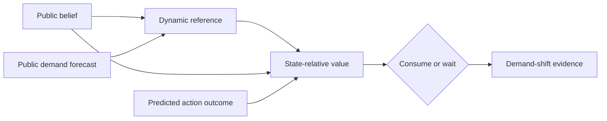

# M2 — Endogenous regulation

M2 replaces two externally imposed shortcuts in the M1 control loop. A static
set point becomes a bounded reference generated from public state belief and
predicted demand; a state-independent resource reward becomes the signed
reduction in deviation from that reference. Together they make the selected
action depend on what the agent predicts it will need and where it currently
believes itself to be.

## Closure record

| Work package | Claim | Decisive observation | Receipt |
| --- | --- | --- | --- |
| MW-020 | Forecast and state generate a bounded, anticipatory reference. | All 100 paired seeds reduced time outside viability by 3 ticks with no irreversible-error increase. | [PR #47](https://github.com/kmosoti/cognitive-miniworld/pull/47) |
| MW-021 | Outcome value is relative to current state and reference. | The same +20 outcome had values `+8`, `0`, and `-16` in deprivation, sufficiency, and excess. | [PR #48](https://github.com/kmosoti/cognitive-miniworld/pull/48) |
| M2 | The two mechanisms compose into behavior. | The controller waited while marginal value was nonpositive and consumed at tick 8 after it became positive. | [M2 verdict](../../verdicts/M2.md) |

The result is deliberately narrower than a general theory of motivation. The
resource-effect probe is a preregistered public action-model hypothesis, not
hidden resource quality or a learned causal model. The reference equation and
quadratic regulation cost are explicit design commitments. M2 establishes an
executable, deterministic instance of endogenous regulation in the canonical
`demand_shift` fixture; it does not establish a universal utility function,
optimality, biological identity, or generalization to unseen resources.

## Reading map

- [Science](science.md) reconstructs the hypotheses, controls, calculations,
  results, causal interpretation, and threats to validity.
- [Engineering](engineering.md) maps the equations to contracts and code,
  explains composition and invariants, and gives reproduction commands.
- [Lean 4 proof map](../../formal/README.md) links the idealized equations to
  compiled bounds, monotonicity, valuation, sign, and impossibility theorems.
- [ADR-028](../../adr/ADR-028.md) freezes dynamic-reference design and the
  demand-shift gate.
- [ADR-029](../../adr/ADR-029.md) freezes state-relative valuation and the M2
  composition gate.
- [MW-020 verdict](../../verdicts/MW-020.md) and
  [MW-021 verdict](../../verdicts/MW-021.md) are the concise closure decisions.
