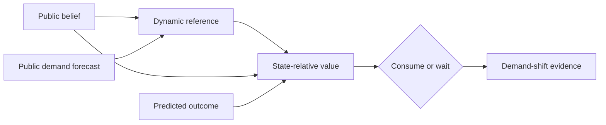

# M2 — Endogenous regulation

M2 replaces a static externally supplied target and state-independent outcome
valence with a public, forecast-bound regulatory loop. A belief and predicted
demand generate a bounded reference trajectory; predicted outcomes are then
valued by how much they reduce deviation from that fixed trajectory.

The milestone closes two separable claims. MW-020 showed that forecast-aware
references anticipate the canonical demand shift and outperform the registered
fixed-setpoint controller without a safety regression. MW-021 showed that the
same resource outcome can be beneficial, neutral, or harmful depending on the
current state, and made that signed value select the MW-020 action.

The accepted result is deliberately bounded. The resource-effect probe is a
preregistered public action-model hypothesis, not hidden resource quality or a
learned causal model. M2 establishes executable endogenous regulation in one
fixture; it does not establish a universal utility function or biological
identity.

- [Science: hypotheses, comparisons, results, and limits](science.md)
- [Engineering: equation, contracts, composition, and reproduction](engineering.md)
- [MW-020 verdict](../../verdicts/MW-020.md)
- [MW-021 verdict](../../verdicts/MW-021.md)
- [M2 verdict](../../verdicts/M2.md)
